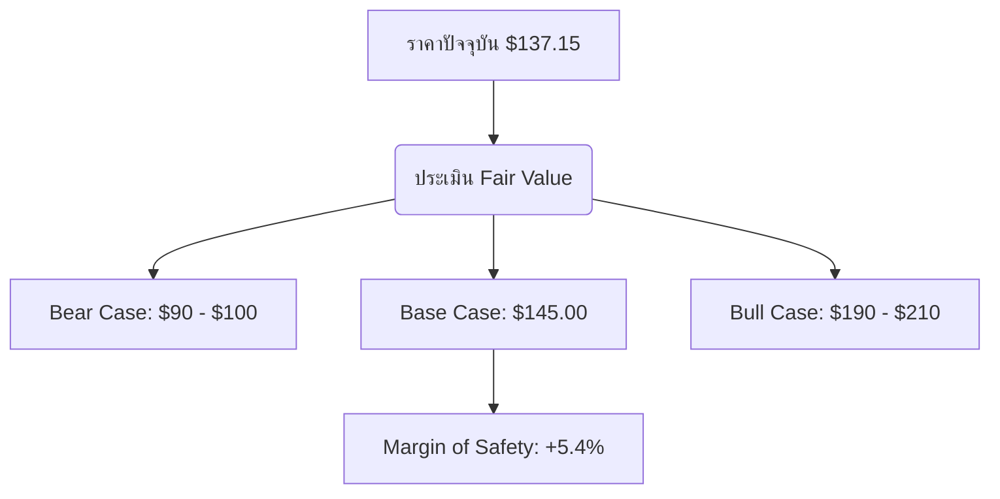

# PLTR — Palantir Technologies — Comprehensive Investment Analysis
**Date:** 2026-05-21 | **Current Price:** $137.15 | **Mode:** Full Analysis (Mode 6)

---

## 🚦 SYSTEM VERDICT: ⚪ HOLD (คงน้ำหนักการถือครองเท่าเดิม)
> **"Great Business, Stretched Valuation"** — Palantir เป็นกิจการที่มี Moat และ Operational Flywheel ยอดเยี่ยมที่สุดตัวหนึ่งในกลุ่ม Enterprise Software แต่ในมิติการประเมินมูลค่า หุ้นไม่มี Margin of Safety มากพอสำหรับการเปิดสถานะซื้อเพิ่มในขณะนี้ อย่างไรก็ดี ด้วยขนาดตำแหน่งปัจจุบันในพอร์ตเพียง 1.33% (Speculation Bucket) จึงแนะนำให้ "ถือรอรอบการเติบโต" โดยห้ามไล่ราคาซื้อเพิ่ม และตั้งจุด Invalidated Trigger ไว้อย่างชัดเจน

| ตัวชี้วัดสำคัญ | ค่าปัจจุบัน | การประเมินสถานะ |
|---|---|---|
| **Conviction Score** | **5.0 / 10** | คงที่ (Watch List - Speculation Bucket) |
| **Research Integrity Score** | **92 / 100** ✅ | ข้อมูลอ้างอิงและงบการเงินมีความโปร่งใสสูง |
| **Fair Value (Base Case)** | **$145.00** | ประเมินด้วย DCF Model (WACC 9.5%) |
| **Current Price vs Fair Value** | **$137.15** | ตลาดซื้อขายต่ำกว่าราคาเหมาะสมขนาดเล็ก |
| **Margin of Safety (MoS)** | **+5.4%** ⚠️ | ต่ำกว่าระดับปลอดภัยขั้นต่ำ 20% (ห้ามเพิ่มไม้ใหม่) |
| **Portfolio Fit Score** | **6.5 / 10** | เหมาะเป็น Speculative Tailwind ในสัดส่วนจำกัด |
| **Max Recommended Position** | **3.0%** | ปัจจุบันพอร์ตถือครองอยู่ที่ 1.33% (ผ่านเกณฑ์) |
| **Emotional Clearance** | ✅ **CLEAR** | ปราศจาก FOMO และ Recency Bias |

---

## 1. Executive Summary (บทสรุปผู้บริหาร)
Palantir Technologies (PLTR) รายงานผลประกอบการไตรมาส 1 ปี 2026 ได้อย่างน่าทึ่งด้วยรายได้ $1.63 Billion เติบโตกระชากตัวถึง **+85% YoY** ซึ่งเป็นอัตราการเติบโตที่รวดเร็วที่สุดนับตั้งแต่บริษัทเข้าจดทะเบียนในตลาดหลักทรัพย์ (IPO 2020) การเติบโตถูกขับเคลื่อนโดยแรงส่งหลักสองทางคือ:
1. **US Commercial Revenue (+133% YoY):** การเร่งตัวอย่างรวดเร็วของ AIP (Artificial Intelligence Platform) ผ่านโมเดลการขายแบบ "Bootcamp" ร่วมกับการจับมือขยายพันธมิตรระดับยักษ์ใหญ่เช่น SAP และ Accenture
2. **US Government Revenue (+84% YoY):** การได้รับสัญญาความมั่นคงระยะยาวจาก DHS มูลค่า $1 Billion BPA รวมถึงสัญญา Maven AI และสัญญาใหม่ล่าสุดกับกระทรวงเกษตร (USDA) มูลค่าสูงสุด $13.3 Million

อย่างไรก็ดี แม้ทิศทางธุรกิจจะเข้าสู่สภาวะเครื่องยนต์ร้อนจัด (Hyper-growth phase) แต่ราคาหุ้นในตลาดปัจจุบันที่ $137.15 ขยับขึ้นมาสะท้อนมูลค่าล่วงหน้าค่อนข้างมาก โดยมีค่าตัวเลขทวีคูณ **Trailing P/E สูงถึง 154.1x** และ **Trailing P/S อยู่ที่ 62.94x** แม้จะมีการปรับประมาณการ Guidance ปี 2026 เพิ่มขึ้นเป็น $7.65B (+71% YoY) ส่งผลให้ Forward P/S ปรับลดความตึงตัวลงมาอยู่ที่ **42.9x** แต่ก็ยังเป็นระดับพรีเมียมที่แทบไม่เหลือพื้นที่ให้สำหรับความผิดพลาดใด ๆ (Margin of Safety เพียง +5.4%) ทางระบบจึงออก Verdict ให้ **⚪ HOLD**

---

## 2. Investment Thesis & Flywheel (สมมติฐานการลงทุน)
แก่นแท้ของความแข็งแกร่งของ Palantir ไม่ใช่เป็นเพียงบริษัทวิเคราะห์ข้อมูลทั่วไป (Data Analytics) แต่บริษัทกำลังพัฒนาขึ้นมาเป็น **"Operating System for Enterprise AI"** (ระบบปฏิบัติการปัญญาประดิษฐ์ขององค์กร) 

### ⚙️ The AIP Flywheel:
* **The Ontology Moat:** แพลตฟอร์ม Foundry และ Gotham ทำหน้าที่เชื่อมต่อและสร้างโครงสร้างความสัมพันธ์ของข้อมูลดิบในองค์กร (Data Silos) ออกมาเป็นวัตถุดิจิทัลที่เข้าใจง่าย (Ontology) ซึ่ง Ontology นี้คือโครงสร้างพื้นฐานที่สำคัญที่สุดที่ทำให้ปัญญาประดิษฐ์ (AI Agents) สามารถนำไปประยุกต์ใช้กับหน้างานจริงโดยไม่มีการหลอน (Hallucinations)
* **High Switching Cost:** เมื่อองค์กรย่อยของรัฐบาลหรือธุรกิจขนาดใหญ่นำระบบ Palantir เข้าไปเชื่อมต่อกับแกนกลางการทำงานหลัก (Core Workflow) แล้ว อัตราการเปลี่ยนไปใช้คู่แข่งรายอื่นจะต่ำมาก (Switching cost มหาศาล) สะท้อนผ่านอัตรา **Net Revenue Retention (NRR) ที่สูงถึง 134%**

---

## 3. Research Integrity & Data Quality (Agent 09 — ความถูกต้องของข้อมูล)
จากการตรวจสอบคุณภาพหลักฐานและแหล่งข้อมูลอ้างอิงในเซสชันนี้ ระบบให้ระดับความเชื่อมั่น **92/100** โดยมีประเด็นสำคัญดังนี้:
* **GAAP Profitability Verification:** ตัวเลขกำไร GAAP Net Income ใน Q1 2026 อยู่ที่ $228 Million (GAAP Diluted EPS $0.34) ยืนยันว่าผลกำไรของบริษัทเป็นกำไรที่เกิดขึ้นจริงอย่างเป็นทางการตามมาตรฐานบัญชี ไม่ใช่กำไรแบบปรุงแต่งทางการเงิน (Adjusted)
* **Stock-Based Compensation (SBC) Audit:** ตรวจพบว่าบริษัทมีค่าใช้จ่ายในการจ่ายผลตอบแทนพนักงานด้วยหุ้น (SBC) สูงถึง **$201.6 Million ใน Q1 2026** คิดเป็น **12.3% ของรายได้ทั้งหมด** แม้จะเป็นระดับที่ต้องเฝ้าระวังการเจือจางหุ้น (Dilution risk) แต่ถือว่าปรับตัวดีขึ้นอย่างชัดเจนเมื่อเทียบกับอดีตที่มีสัดส่วน SBC สูงกว่า 30%
* **Cash Flow Check:** FCF GAAP แบบ 12 เดือนย้อนหลัง (TTM) อยู่ที่ $1.75 Billion หากหักลบผลกระทบของ SBC ทั้งปี (ประมาณ $800M TTM) จะได้ Free Cash Flow ที่เป็นเงินสดจริง ๆ เท่ากับประมาณ $950 Million ซึ่งแปลงเป็น FCF Margin หลังหัก SBC ที่แท้จริงเท่ากับ **18.2%** (หากไม่หัก SBC จะอยู่ที่ **33.5%** ของรายได้ TTM $5.22B) สะท้อนถึงคุณภาพกำไรและระดับกระแสเงินสดที่แข็งแกร่งมาก แต่ไม่ได้สูงผิดปกติถึง 95% ตามข้อผิดพลาดเชิงมิติเวลาก่อนหน้า

---

## 4. News & Sentiment (Agent 01 — สกัดข่าวสารและอารมณ์ตลาด)
**Sentiment Score:** **+6 / 10** (ค่อนข้างเป็นบวก แต่มีความกังวลเรื่องการประเมินมูลค่า)

### 📌 Catalyst Map (แผนที่ปัจจัยกระตุ้น):
1. **SAP & Accenture Expansion (12 พ.ค. 2026):** SAP และ Accenture ประกาศขยายความร่วมมืออย่างเป็นทางการเพื่อนำ Palantir AIP ไปผสานเข้ากับระบบ ERP Cloud ของ SAP เพื่อเร่งกระบวนการเปลี่ยนผ่านข้อมูลด้วย AI (AI-enabled data migration) — *เป็นปัจจัยหนุนระยะกลางที่สำคัญมากต่อฝั่ง Commercial*
2. **USDA Contract (1 พ.ค. 2026):** การคว้าสัญญากับกระทรวงเกษตรสหรัฐฯ มูลค่าเริ่มต้น $3.9 Million (ขยายได้สูงสุดถึง $13.3 Million) เพื่อนำเสนอตัววัดผลประสิทธิภาพการกลับเข้าทำงานที่ทำงาน (Return-to-office) ของข้าราชการ — *พิสูจน์ความสามารถในการขยายตลาดข้าราชการพลเรือน นอกเหนือจากทหาร/ความมั่นคง*
3. **U.S. Army "Right to Integrate" Hackathon (6 พ.ค. 2026):** การจับมือประสานเทคโนโลยีการเชื่อมต่อข้อมูลในระดับยุทธวิธีกลาโหม — *รักษาความแนบแน่นในฐานลูกค้ารัฐบาลกลาง*

---

## 5. Fundamental Analysis (Agent 02 — งบการเงินและการประเมินมูลค่า)

### 📈 Financial Metrics Snapshots (ข้อมูลล่าสุด ณ วันที่ 21 พ.ค. 2026):
* **Revenue (TTM):** $5.22 Billion (+85% YoY ในไตรมาสล่าสุด)
* **Operating Margin:** 46% (สะท้อน operating leverage ที่แข็งแรงมาก ต้นทุนผันแปรต่อหน่วยซอฟต์แวร์ต่ำมาก)
* **Gross Margin:** 84% (คงระดับผู้นำซอฟต์แวร์ระดับโลก)
* **Net Cash:** **$7.81 Billion** (Cash $8.03B - Debt $212M) — *สภาวะปลอดหนี้ มีกระสุนเงินสดมหาศาลในการทำ R&D และ M&A*

### 📊 Valuation Modeling (ประเมิน DCF):
ระบบใช้สมมติฐานอนุรักษ์นิยม WACC ที่ 9.5% (ปรับเพิ่มตามสภาวะอัตราดอกเบี้ยพันธบัตร 30 ปีที่พุ่งสูง 5.12% เพื่อสะท้อนความเสี่ยงเชิงมหภาค):

* **Base Case ($145.00):** สมมติว่ารายได้ปี 2026 โต 71% ตาม guidance ($7.65B) และค่อยๆ ชะลอลงมาเติบโต 40% ในปีที่ 2-3 และ 25% ในปีที่ 4-5 โดยคง Operating Margin ที่ 46% 
* **Bear Case ($90.00):** สมมติว่าลูกค้าฝั่ง Commercial ชะลอการขยายเนื่องจากการแข่งขันของ Google Gemini Spark และ Microsoft และรายได้ฝั่งรัฐบาลเติบโตต่ำกว่าคาด ส่งผลให้การเติบโตระยะยาวดิ่งลงเหลือ 15-20%
* **Margin of Safety:** ราคาปัจจุบันที่ $137.15 ต่ำกว่าราคาเหมาะสมฐาน 5.4% ซึ่งถือว่าปลอดภัยในระดับหนึ่งในการถือครอง **แต่ไม่เพียงพอต่อการทุ่มเงินใหม่ซื้อสะสม** เนื่องจากขัดต่อกฎ Margin of Safety Minimum Requirement 20% ของระบบ

---

## 6. Technical Timing (Agent 03 — สัญญาณทางเทคนิครายวัน)
**Technical Timing Verdict:** **Sideways / Accumulation Stage**

จากการตรวจสอบชุดเครื่องมือเทคนิคผ่าน Twelve Data (21 พ.ค. 2026):
* **RSI (Daily):** **47.87** (อยู่กึ่งกลางระดับปกติ ไม่ Overbought และไม่ Oversold สะท้อนสภาพการพักฐานและสะสมกำลังไร้ทิศทางเด่นชัด)
* **MACD:** macd -2.299, macd_signal -2.368, **macd_hist: +0.069** (ตัวแท่งฮิสโตแกรมเริ่มหักหัวพลิกตัดขึ้นเป็นบวกเล็กน้อย แสดงถึงความพยายามของแรงซื้อในการฟื้นตัวทางราคาอ่อน ๆ)
* **Bollinger Bands (กรอบแนวรับ-แนวต้าน):**
  * **Lower Band (แนวรับจิตวิทยา):** **$129.95** (หากราคาย่อตัวลงมาทดสอบโซน $128-$130 ถือเป็นจุดพิจารณาที่เริ่มปลอดภัย)
  * **Middle Band (ค่าเฉลี่ย):** **$137.94** (ราคาปัจจุบันที่ $137.15 ยืนคลอเคลียอยู่ตรงค่าเฉลี่ยกลางพอดี)
  * **Upper Band (แนวต้านสั้น):** **$145.94**
* **ATR (Average True Range):** **5.78** (กรอบการวิ่งของราคาเฉลี่ยอยู่ที่ประมาณ $5.78 ต่อวัน ค่อนข้างผันผวนสูงตามธรรมชาติ of หุ้นเทคโนโลยีที่มีเบต้า 1.52)

---

## 7. Macro & Geopolitical Thematic (Agent 05 — ปัจจัยมหภาคและความมั่นคง)
Palantir เป็นหนึ่งในผู้ได้รับผลประโยชน์สูงสุด (Structural Tailwind) จากสงครามเชิงมหภาคและภูมิรัฐศาสตร์ระดับโลก in ปัจจุบัน:
* **Israel-Iran & Hormuz Strait Crisis:** สภาวะสงครามและการปิดช่องแคบฮอร์มุซ ยืดเยื้อดันงบประมาณความมั่นคงและการป้องกันประเทศของชาติตะวันตก (Pentagon Budget) ทะยานขึ้นสู่เป้าหมาย $1.5 Trillion ในปี 2027 สัญญาทางทหารเช่น Maven AI กลายเป็นความจำเป็นหลักของกองทัพสหรัฐฯ ในการทำสงครามอัจฉริยะ (Algorithmic Warfare)
* **US-led Semiconductor Alliance (Pax Silica):** ข้อตกลงความมั่นคงด้านเซมิคอนดักเตอร์และระบบซอฟต์แวร์ความมั่นคงของ 9 ประเทศพันธมิตรตะวันตก ทำหน้าที่เป็นกำแพงทางกฎหมายป้องกันคู่แข่งจากซีกโลกตะวันออกอย่างเบ็ดเสร็จ ส่งผลให้รัฐบาลกลุ่ม NATO, UK GCHQ ยึดติดกับการใช้งาน Gotham ไปโดยปริยาย

---

## 8. Competitive Moat (Agent 06 — ความแข็งแกร่งของค่ายคูเมือง)
* **The Security Clearance Barrier:** การที่คู่แข่งรายย่อยหรือแม้กระทั่ง Big Tech บางรายจะก้าวเข้ามาโค่นล้ม Gotham ในงานระดับความมั่นคงชั้นความลับสูงสุด (Classified Data) แทบเป็นไปไม่ได้ เนื่องจากต้องใช้เวลาในการตรวจสอบประวัติและการได้รับสิทธิ์การเข้าถึงข้อมูลทางทหารขั้นสูงสุด ซึ่ง Palantir ฝังตัวอยู่ในจุดนี้มานานกว่า 20 ปี (ตั้งแต่ก่อตั้งปี 2003 โดย CIA In-Q-Tel เป็นผู้สนับสนุนช่วงแรก)
* **Google Gemini Spark (The Commercial SME Threat):** ภัยคุกคามหลักจากค่าย Google ที่เพิ่งเปิดตัว Gemini Spark (โมเดลการรัน Autonomous Agent ตลอด 24 ชั่วโมงผ่าน GCP VM ราคาประหยัด $100/เดือน) จะเข้ามาแย่งชิงฐานลูกค้าฝั่ง Commercial ระดับกลางและเล็ก (SMEs) แต่ในระดับองค์กรขนาดใหญ่ที่มีความซับซ้อนของโครงสร้างข้อมูล (Large Enterprises) ค่ายคูเมือง Ontology ของ Palantir ยังคงปกป้องตลาดส่วนนี้ไว้ได้อย่างดีเยี่ยม

---

## 9. Smart Money & Insider (Agent 07 — แรงขับเคลื่อนของผู้เล่นรายใหญ่)
* **Institutional Ownership:** สถาบันการเงินถือครองหุ้น PLTR อยู่ที่ระดับ **62%** บ่งบอกถึงความมั่นใจของนักลงทุนสถาบันในการทยอยเข้าสะสมอย่างต่อเนื่องหลังบริษัทผ่านเกณฑ์เข้าคำนวณในดัชนี S&P 500
* **Insider Transactions:** อัตราการถือครองของบุคคลภายใน (Insiders) อยู่ที่ **4%** โดยมีพฤติกรรมขายทำกำไรออกมาเป็นระยะ ๆ ตามสิทธิ์ของ Alex Karp และ Peter Thiel ในการแปลงสภาพใบสำคัญแสดงสิทธิสิทธิตามกำหนดเวลา (Rule 10b5-1) ซึ่งไม่ใช่สัญญาณบ่งบอกถึงปัจจัยลบเชิงปัจจัยพื้นฐาน

---

## 10. ESG & Catastrophic Risk (Agent 08 — ความเสี่ยงเชิงระบบและจรรยาบรรณ)
* **Governance Grade (ISS Risk):** **10/10 ⚠️ (ความเสี่ยงสูงสุดในทุกด้าน)** 
  * โครงสร้างของสิทธิ์ออกเสียงเอื้อประโยชน์แก่ผู้ก่อตั้งอย่างเบ็ดเสร็จเด็ดขาดผ่านการถือครองหุ้น Class F (Multi-class share structure) ส่งผลให้ผู้ถือหุ้นรายย่อยทั่วไปไม่มีสิทธิ์ถ่วงดุลอำนาจคณะกรรมการบริหาร
* **Human Rights Issues (15 พ.ค. 2026):** มีกลุ่มนักลงทุนเรียกร้องและยื่นเอกสาร Exempt Solicitation สนับสนุนข้อเสนอให้บริษัทจัดทำและเผยแพร่ผลกระทบด้านสิทธิมนุษยชน (Human Rights Impact Assessment) เกี่ยวกับการประยุกต์ใช้ระบบ Gotham และระบบวิเคราะห์ใบหน้าประชากรในภารกิจจับกุมของ ICE และกองกำลังตำรวจชายแดน ซึ่งเป็นความเสี่ยงด้านภาพลักษณ์และประเด็นฟ้องร้องทางกฎหมาย (Legal & Reputation Risk Overhang)

---

## 11. Portfolio Fit & Allocation (Agent 04 + 10 — ความเหมาะสมต่อโครงสร้างพอร์ต)
* **Current Holding:** 0.88 หุ้น | **Avg Cost:** $154.23 | **Current Value:** $120.94 (G/L: **-11.07%**)
* **Allocation:** **1.33%** ของสินทรัพย์รวม
* **Whole-portfolio Assessment:** ในปัจจุบันพอร์ตการลงทุนของเรามีระดับการกระจุกตัวในกลุ่มเทคโนโลยีและปัญญาประดิษฐ์ (AI/Tech/Space Cluster: RKLB, NVDA, GOOGL, AMZN, PLTR) ค่อนข้างสูงอยู่แล้วที่ประมาณ **65-66%** ของพอร์ต การไม่เพิ่มน้ำหนักของ PLTR ในสภาวะราคาพรีเมียมนี้ถือเป็นการตัดสินใจที่ถูกต้องในการควบคุมปัจจัยเสี่ยงของพอร์ต (Beta Control)

---

## 12. Execution & FX Reality Check (Agent 11)

### 💱 FX Reality Check:
| รายการ | ค่าปัจจุบัน |
|---|---|
| อัตราแลกเปลี่ยน USD/THB | ฿32.60 |
| มูลค่าหุ้น PLTR ในพอร์ต (THB) | ฿3,942.64 |
| เงินสดคงเหลือในพอร์ต (Dry Powder) | $1,549.88 (17.04%) |

### 📋 Action Plan (แผนดำเนินการแบ่งไม้):
เนื่องจากประเมินตามกฎอย่างเข้มงวดแล้ว **ไม่มีการซื้อเพิ่มในราคาปัจจุบัน** แต่เราได้จัดทำระดับราคาหากเกิดเหตุการณ์ตลาดปรับฐานใหญ่ (Market Correction) ไว้ล่วงหน้าดังนี้:

| ไม้ที่ | ระดับราคาเป้าหมาย (USD) | เงื่อนไข Trigger | ขนาด Tranche แนะนำ |
|---|---|---|---|
| **ไม้ที่ 1** | **$120.00 – $125.00** | ย่อตัวทดสอบกรอบล่าง Bollinger Bands + RSI แตะโซน <40 | $100 (~0.7 หุ้น) |
| **ไม้ที่ 2** | **$100.00 – $105.00** | Valuation Repricing / ตลาดตื่นตระหนก yields พุ่ง | $150 (~1.4 หุ้น) |

---

## 13. Thesis Monitoring (Agent 12 — แผนการติดตามประเด็นสำคัญ)

### 📈 Thesis Status Dashboard:
| Ticker | Status | KPI หลักที่ต้องติดตาม | Review ถัดไป | Thesis Breaker |
|---|---|---|---|---|
| **PLTR** | 🟡 **Watch** | NRR ต้องยืนเหนือ **130%** / อัตราการเติบโตรายได้ Q2 2026 ต้องไม่ต่ำกว่า **60% YoY** | **2026-08-10** (หลังงบ Q2) | สัญญารัฐบาลสหรัฐฯ ถูกหั่นงบประมาณอย่างมีนัยสำคัญ หรือ NRR ดิ่งต่ำกว่า 115% |

---

## 14. Behavioral Journal (Agent 13 — การบันทึกและสแกนอคติเชิงอารมณ์)

### 🧠 Behavioral Bias Scan:
* **FOMO Risk (Low):** ไม่มีสภาวะกลัวการตกขบวน เนื่องจากเราถือหุ้นตัวนี้อยู่แล้วและราคากำลังอยู่ในช่วงสะสมพลัง Sideways
* **Anchoring Risk (Medium):** การยึดติดกับราคาต้นทุนเฉลี่ยของเราที่ $154.23 ซึ่งในสภาวะจริงเราต้องยอมรับว่าต้นทุนของเราสูงเกินไปเนื่องจากเข้ามาซื้อในช่วงปลายยอดดอย (Overvalued peak) การแก้ไขคือต้องตัดอคติต้นทุนเดิมออก และตัดสินใจบนฐานมูลค่าเหมาะสมที่แท้จริง ($145.00) เสมอ
* **🔥 Pre-Mortem (ถ้าหากวิเคราะห์นี้ผิดพลาดในอีก 12 เดือนข้างหน้า เกิดจากอะไร):**
  1. การแย่งชิงตลาด AI ของ Big Tech (Google Spark, MSFT Azure AI) ประสบความสำเร็จอย่างสมบูรณ์แบบจนแย่งลูกค้าองค์กรขนาดใหญ่ของ Foundry ไปได้ ส่งผลให้การเติบโตฝั่ง Commercial สะดุดอย่างรุนแรง (ความน่าจะเป็น 35%)
  2. รัฐบาลสหรัฐฯ ทำการหั่นงบประมาณเชิงกลาโหมความมั่นคงด้านไอทีเนื่องจากปัญหาวิกฤติเพดานหนี้และงบประมาณขาดดุลที่ทะลุ $1.9 Trillion (ความน่าจะเป็น 25%)

---

## 15. Action Checklist
* [x] รัน yfinance + twelvedata เพื่อตรวจสอบราคาและสัญญาณล่าสุด
* [x] คำนวณความเหมาะสมในการจัดสรรพอร์ตโฟลิโอ (Allocation Check < 2%)
* [x] วิเคราะห์เจาะลึกงบการเงินและตรวจหาส่วนเบี่ยงเบน SBC / Dilution ในงบ Q1 2026
* [x] สรุปผลความเหมาะสม (Verdict: HOLD)
* [x] บันทึกบทวิเคราะห์ลงสู่ระบบไฟล์เพื่อจัดเก็บประวัติอย่างเป็นทางการ

---

## 16. References (ข้อมูลอ้างอิงและวันที่สืบค้น)
1. **[DHS Surveillance $1B Palantir Contract — TechRadar / 2026-05-10]**
   * https://www.techradar.com/pro/palantir-awarded-usd1-billion-dhs-contract-for-ai-and-data-analytics-rollout
2. **[Palantir SEC Form 10-Q Q1 2026 Financial Report — SEC EDGAR / 2026-05-04]**
   * https://www.sec.gov/Archives/edgar/data/0001321655/000132165526000028/pltr-20260331.htm
3. **[SAP, Accenture, and Palantir Extension Partnership — The Street / 2026-05-12]**
   * https://finance.yahoo.com/news/sap-accenture-palantir-extend-partnership-131300000.html
4. **[US Department of Agriculture Return-to-office Tracker Contract — Prospect / 2026-05-01]**
   * https://prospect.org/labor/2026-05-01-palantir-usda-surveillance/
5. **[Shareholder Proposal on Human Rights Impact Assessment — Simply Wall St / 2026-05-15]**
   * https://simplywall.st/stocks/us/software/nyse-pltr/palantir-technologies/news/solicitation-supporting-proposal-for-human-rights-report-filed-by-investor-group
6. **[U.S. Army Integrated Hackathon Sprint Data Interoperability — Palantir IR / 2026-05-06]**
   * https://www.palantir.com/newsroom/press-releases/us-army-hackathon/
