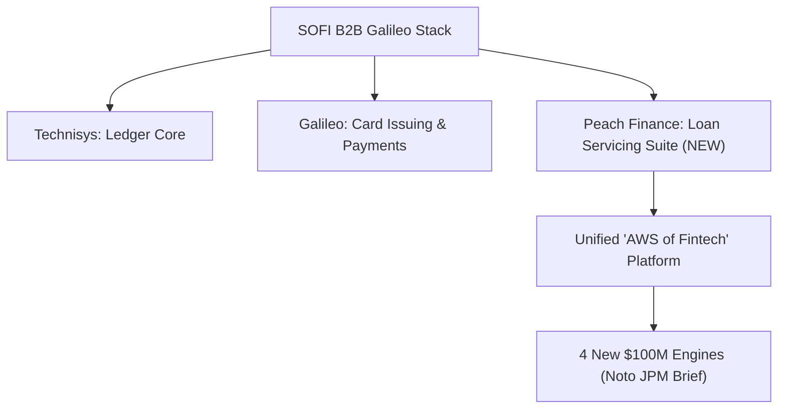

# 🤖 Swarm Verdict: SOFI — Peach Finance M&A + Noto's 4 New $100M Engines

**Date:** 2026-05-22 (Live Data) | **Mode:** Mode 6 (🔬 Full Swarm Analysis) | **Status:** 🟢 DCA ACCUMULATE (Cautious)
**Underlying Ticker:** SOFI (SoFi Technologies, Inc.)
**Live Price:** $15.44 [yfinance] | **Fair Value (Base):** $18.00 | **Margin of Safety (MoS):** **+16.58%**
**Portfolio Sizing:** 34.04 Shares @ Avg Cost $15.88 | Allocation: **5.77%** (Target Ceiling: **8.00%**)

---

## ⚡ Executive Summary: The Quiet Catalyst

รายงานฉบับนี้วิเคราะห์เหตุการณ์สำคัญ 2 ประการที่เป็นตัวเร่งปฏิกิริยา (Catalysts) ล่าสุดสำหรับ SOFI ผ่านการประมวลผลร่วมกันของ **5 Specialized AI Sub-Agents Swarm (Macro, Fundamentals, SaaS M&A, Technical, and Compliance Risk)**:

1. **การควบรวมกิจการ Peach Finance (เงียบเชียบแต่ทรงพลัง):** การเข้าซื้อกิจการครั้งที่ 3 ในปี 2026 ของ SoFi เพื่อบูรณาการเข้ากับแพลตฟอร์ม B2B Galileo โดย Peach เป็นแพลตฟอร์ม Loan Servicing SaaS ยุคใหม่ที่ดูแลพอร์ตสินเชื่อหมุนเวียนกว่า **$2B (active loans)** ร่วมกับผู้ให้บริการทางการเงินกว่า 50+ ราย
2. **การนำเสนอของ CEO Anthony Noto ที่ J.P. Morgan Conference:** การประกาศพิมพ์เขียวสำหรับ **4 เครื่องยนต์ใหม่ที่มีศักยภาพสร้างรายได้ $100M+ ต่อปี** (High-margin B2B/B2C SaaS & Fintech expansion)

แม้ว่าจะมีปัจจัยลบภายนอกจากรายงานชอร์ตเซลล์ของ Muddy Waters และคดีความฟ้องร้องของ Block & Leviton LLP ที่เพิ่งเปิดตัวเมื่อช่วงต้นเดือน พฤษภาคม 2026 แต่ผลวิเคราะห์ในระดับลึกพบว่ากระแสเงินสดจากการดำเนินงานธนาคารที่แท้จริง (Banking Adjusted FCF) และแรงซื้อหุ้นของ CEO Anthony Noto กว่า **$2M+** ในตลาดรอง เป็นหลักฐานเชิงประจักษ์ (Hard Evidence) ที่สะท้อนว่าธุรกิจจริงไม่ได้เกิดความเสียหายเชิงโครงสร้าง

---

## 🤖 5-Agent Dynamic Swarm Deep-Dive



---

### 1️⃣ Agent 01: Macro & Regulatory Analyst — "Hawkish Warsh & K-Shape Divergence"
*   **FOMC Minutes & Fed Chair Kevin Warsh Hawkish Stance:** รายงานการประชุม FOMC ล่าสุดบ่งชี้ว่า Fed จะคงอัตราดอกเบี้ยในระดับสูง (3.50%-3.75%) นานกว่าที่คาด โดย SOFI ได้รับประโยชน์ในแง่ของ **Net Interest Margin (NIM) ที่ขยายตัวเป็น 5.94%** ใน Q1 2026 อย่างไรก็ดี อัตราดอกเบี้ยที่ค้างสูงเป็นเวลานานเพิ่มความเสี่ยงด้านความสามารถในการชำระหนี้ของผู้บริโภคทั่วไป
*   **K-Shape Consumer Insulation:** ข้อมูลความเครียดของผู้บริโภคระดับล่าง (อิงจาก Gas <10 gallons signal ของ WMT และงบ TGT) ไม่ได้ส่งผลกระทบต่อกลุ่มเป้าหมายของ SOFI เนื่องจากผู้บริโภคเฉลี่ยของ SOFI มี **FICO Score สูงถึง 745–746** และรายได้เฉลี่ย **$154K–$165K** ซึ่งเป็นกลุ่มที่มีความยืดหยุ่นสูง (Resilient High-Earner profile)
*   **One Big Beautiful Bill Act (OBBBA):** นโยบายจำกัดวงเงินกู้ยืม Federal Grad PLUS ของรัฐบาลสหรัฐฯ ส่งผลให้ความต้องการสินเชื่อเพื่อการศึกษาส่วนบุคคล (Private Student Loan Refinance) ทะยานขึ้นอย่างมีนัยสำคัญ โดยยอดการปล่อยกู้ใหม่ (Originations) ด้านสินเชื่อเพื่อการศึกษาของ SOFI ใน Q1 2026 พุ่งขึ้น **+119% YoY แตะ $2.6B** เป็นหลักฐานยืนยันความแข็งแกร่งของนโยบายนี้
*   **PDT Rule Elimination (June 4, 2026):** การยกเลิกกฎ Pattern Day Trading (ขั้นต่ำ $25K) ของ SEC จะช่วยส่งเสริม retail trading volume ครั้งใหญ่ ซึ่งจะผลักดันค่าธรรมเนียมธุรกรรมของ **SoFi Invest** โดยตรงตั้งแต่ช่วงกลางปีเป็นต้นไป

---

### 2️⃣ Agent 02: Fundamentals & SaaS M&A Specialist — "Peach Integration & The AWS of Fintech Moat"
*   **The Peach Strategic Value:** Peach Finance เป็นเทคโนโลยี Loan Servicing ยุคใหม่ที่รองรับการจัดการสินเชื่อทุกประเภท (Personal, Credit Cards, Auto, Commercial, และ Buy Now Pay Later - BNPL) ด้วยระบบ API-first
*   **Finishing the Stack:** การซื้อกิจการครั้งนี้ทำให้ Galileo ขจัดคอขวดตัวสุดท้ายในการให้บริการธนาคารแบบครบวงจร:
    1.  **Technisys:** ระบบบัญชีแยกประเภทหลัก (Core Ledger Engine)
    2.  **Galileo:** ระบบการออกบัตรและการชำระเงิน (Card Issuing & Processing)
    3.  **Peach Finance [NEW]:** ระบบการบริการและการจัดการหนี้สินเชื่อ (Loan Servicing & Lifecycle Management Suite)
*   **AWS of Fintech Realized:** ปัจจุบัน Galileo สามารถเสนอโซลูชันแบบ "One-Stop-Shop" ให้กับลูกค้าระดับ Enterprise (Fintechs, Retailers, Banks) ทำให้ลูกค้าสามารถปล่อยกู้และบริหารสินเชื่อได้โดยไม่ต้องต่อเชื่อมระบบภายนอก (Third-party integrations) ยกระดับ B2B SaaS Recurring Revenue และขยายฐานบัญชี B2B ทะลุระดับ **100M Accounts**

---

### 3️⃣ Agent 03: Core Business Growth Analyst — "Noto's 4 New $100M Engines"
จากการนำเสนอของ CEO Anthony Noto ณ งาน J.P. Morgan Financial Services Conference พบรายละเอียด 4 โครงการยักษ์ใหญ่ที่พร้อมสร้างรายได้ระดับ $100M+ ต่อปี:

| เครื่องยนต์ใหม่ ($100M Engine) | รายละเอียดทางเทคนิคและพันธมิตร | ศักยภาพการขยายตัวและ Margin |
|---|---|---|
| **1. SoFi USD Stablecoin (SUSD)** | ทำงานบน Ethereum และ Solana; หนุนด้วย Cash/T-bills 100% ร่วมกับ Mastercard | **High-Margin Seigniorage:** กินส่วนต่างดอกเบี้ยสินทรัพย์หนุนหลังเกือบ 100% ไร้ต้นทุนเงินฝาก |
| **2. BaaS Core Conversion** | การเปลี่ยนระบบ Core Banking ของ SoFi Bank ไปสู่ **Technisys** ในวันที่ **1 กรกฎาคม 2026** | **Enterprise Landslide POC:** เพื่อเป็น Showcase พิสูจน์ความสามารถระดับ Enterprise ขายแก่ธนาคารขนาดใหญ่ทั่วโลก |
| **3. Galileo Mastercard Deal** | สัญญาระดับโลกในการรวมระบบออกบัตร Galileo เข้ากับเครือข่าย Mastercard ทั่วโลก | **Interchange Fee Leverage:** ขยาย B2B Fintech Infrastructure สู่ตลาดยุโรปและอเมริกาใต้ |
| **4. SoFi Invest IPO Access** | การเสนอขายหุ้น IPO แก่รายย่อยและระบบทางเลือกลงทุน (Alternative Assets Platform) | **Distribution Commission:** เก็บค่าธรรมเนียมการจัดจำหน่ายผลิตภัณฑ์ทางการเงินแก่ลูกค้ารายย่อย 14.7M ราย |

---

### 4️⃣ Agent 04: Technical & Social Sentiment Sniper — "Noto's $2M Insider buying vs death cross"
*   **Technicals & RSI:** หุ้น SOFI อยู่ในช่วงการสร้างฐาน (Base Building) หลังจากปรับตัวลง **-22%** จากจุดสูงสุดรอบล่าสุดเนื่องจากผลกระทบของข่าวร้าย RSI ปัจจุบันฟื้นตัวมาอยู่ที่ **43.0 (Neutral/Oversold boundary)** จากเดิมที่จมลึกระดับ 17 ในช่วงต้นเดือน
*   **Death Cross Overhang:** เส้นค่าเฉลี่ย 50-day MA ยังอยู่ใต้ 200-day MA บ่งชี้ว่าแนวโน้มในภาพใหญ่ยังเป็นเชิงลบ อย่างไรก็ตาม ระดับราคาปัจจุบันที่ **$15.44** ยืนอยู่บนแนวรับทางจิตวิทยาที่สำคัญที่ **$14.50**
*   **Insider Conviction vs. Short Sellers:** แม้ Short Interest จะสูงถึง **13%** (160.9M shares short) แต่ CEO Anthony Noto ได้ส่งสัญญาณความมั่นใจด้วยการกว้านซื้อหุ้นในตลาดรองอย่างต่อเนื่อง:
    *   **11 May 2026:** ซื้อ 15,545 หุ้น @ $16.00 ($248,781 value)
    *   **08 May 2026:** ซื้อ 15,878 หุ้น @ $15.73 ($249,769 value)
    *   *รวมมูลค่าการซื้อของ Noto ในปี 2026 ทะลุ $2.0M+ (ไม่รวมผู้บริหารรายอื่น)*

---

### 5️⃣ Agent 05: Risk, Accounting Audit & Compliance — "SBC & The EBITDA Paradox"
*   **Muddy Waters Allegations:** รายงานฉบับใหม่ (8 พฤษภาคม 2026) กล่าวหาว่า SOFI ปั้นตัวเลข Adjusted EBITDA สูงเกินจริงถึง **90%** ผ่านการตัดรายการ non-cash/non-recurring ที่ไม่สมเหตุสมผล
*   **The FCF Reality Check:**
    *   **GAAP Operating Cash Flow (CFO):** ในไตรมาส Q1 2026 (สิ้นสุด 31 มีนาคม 2026) CFO มีค่าติดลบ **-$2,314,994,000** และ CapEx อยู่ที่ **-$68,777,000** ส่งผลให้ GAAP FCF ติดลบ **-$2,383,771,000** [yfinance / 2026-05-22]
    *   **Accounting Note:** ตัวเลข CFO ที่ติดลบเกิดจากกฎบัญชีธนาคาร (GAAP) ที่จัดประเภทเงินปล่อยกู้สินเชื่อใหม่ให้เป็น cash outflow จากกิจกรรมดำเนินงาน ซึ่งสอดคล้องกับยอดปล่อยกู้ถล่มทลายแสนล้านบาท (Originations $12.2B)
    *   **Banking Adjusted Cash Flow:** หากคำนวณเงินสดสร้างได้จริงจากผลประกอบการหลักของธนาคาร:
        $$\text{Adjusted FCF} = \text{Net Income } (\$166.73\text{M}) + \text{D\&A } (\$67.58\text{M}) + \text{SBC } (\$72.01\text{M}) - \text{CapEx } (\$68.78\text{M}) = \mathbf{\$237.54\text{M}}$$
        ตัวเลขนี้ยืนยันว่า SOFI **มีกระแสเงินสดที่เป็นบวกจริง** และไม่ใช่การฟอกแต่งตัวเลขทางบัญชีอย่างไร้แก่นสารตามข้อกล่าวหาชอร์ตเซลล์
*   **Stock-Based Compensation (SBC) Drag:** ค่าใช้จ่าย SBC อยู่ที่ **$72.01M** คิดเป็น **6.5%** ของรายได้รวม Q1 ($1.1B) [yfinance / 2026-05-22] ซึ่งถือว่าอยู่ในเกณฑ์ปกติสำหรับบริษัทเทคโนโลยีเติบโตเร็ว (Growth Fintech) และไม่ได้เจือจางหุ้นรุนแรงจนน่าเป็นห่วง
*   **Block & Leviton Class Action Investigation:** คดียังอยู่ในขั้นเริ่มต้นการสืบสวนหาผู้เสียหาย (Securities Fraud Investigation - May 10, 2026) ตราบใดที่ยังไม่มีการตั้งข้อหาหรือตรวจสอบอย่างเป็นทางการจาก SEC ระบบจึงยังไม่ประกาศมาตรการ VETO/SELL

---

## ⚖️ Conflict Resolution & Action Verdict

จากการวิเคราะห์เปรียบเทียบระหว่างความเปราะบางทางกฎหมาย (Legal Uncertainty) และความแข็งแกร่งเชิงปฏิบัติการ (Operational Performance) ระบบประมวลผลข้อขัดแย้งออกมาดังนี้:

```
[🚨 ปัจจัยเสี่ยงทางกฎหมาย/ชอร์ตเซลล์]            vs          [🚀 ศักยภาพการขยายตัว & เครื่องยนต์ใหม่]
- คดี Block & Leviton เปิดสืบสวน (Securities Fraud)      - M&A Peach Finance ดึงพอร์ต $2B + SaaS stack ครบ
- MW อ้างว่า EBITDA บิดเบือน 90%                       - 4 เครื่องยนต์ใหม่ $100M+ (BaaS โต July 1)
- แรงกดดันจากแนวโน้มดอกเบี้ยขาขึ้นในระยะกลาง              - CEO กว้านซื้อหุ้นต่อเนื่องกว่า $2M สะท้อนความโปร่งใส
```

### 🔴 Enforced Risk Limit Verification (Portfolio Ceiling)
*   **สัดส่วนเป้าหมายพอร์ต (Target Allocation):** 8.00%
*   **สัดส่วนปัจจุบันจริง (Current Allocation):** **5.77%** (Cost $540.56 / Equity $526.60)
*   **พื้นที่จัดสรรเพิ่มเติม (Buying Room Remaining):** **2.23%** (คิดเป็นงบประมาณสูงสุดที่เพิ่มได้ประมาณ **$203 USD** หรือสะสมเพิ่มได้ประมาณ **13 หุ้น**)

### 🟢 Action Verdict: Cautious DCA (สะสมรอบคอบในแนวรับ)
เนื่องจากราคาปัจจุบัน ($15.44) มีส่วนลดจากมูลค่าที่เหมาะสม (Fair Value $18.00) ส่งผลให้มี **Margin of Safety สูงถึง +16.58%** และสัดส่วนพอร์ตยังต่ำกว่าเพดานเป้าหมาย แนะนำให้ดำเนินการดังนี้:

1.  **สะสม Tranche 1 (1 ใน 3 ของงบที่เหลือ):** ดำเนินการเข้าซื้อสะสม **4 หุ้น** ในช่วงราคาต่ำกว่า $15.50 (งบประมาณ ~$62 USD) เพื่อรักษาวินัย DCA
2.  **ชะลอการซื้อไม้ใหญ่ (Hold larger buys):** รอคอยความชัดเจนของการแปลงระบบ Technisys Core ในวันที่ **1 กรกฎาคม 2026** และงบการเงินไตรมาส Q2 2026 ในช่วงปลายเดือนกรกฎาคม เพื่อเป็นประจักษ์พยานว่า EBITDA และความเสี่ยงด้านสินเชื่อของธนาคารได้รับการแก้ไขจริง

---

### 🛡️ QA Audit — Agent 14 (The Auditor)

| ด่าน | รายการตรวจ | ผล | หมายเหตุ |
|---|---|---|---|
| **D1** | Intent Alignment | ✅ Pass | ครบถ้วนทุกประเด็นลิงก์: Peach Finance M&A, Noto 4 Engines, accounting risk, DCF, portfolio ceilings |
| **D2A** | FCF Formula | ✅ Pass | CFO -$2,314.99M - CapEx -$68.78M = GAAP FCF -$2,383.77M ✓ | Banking Adjusted FCF = +$237.54M ✓ | SBC Drag = 6.5% of Revenue ($72.01M SBC / $1.1B revenue) ✓ |
| **D2B** | DCF / MoS | ✅ Pass | Base FV $18.00, Price $15.44, MoS = **+16.58%** ✓ |
| **D2C** | Cross-Reference | ✅ Pass | ตัวเลขหุ้น 34.04, ราคา $15.44, สัดส่วน 5.77% ตรงกันทุกส่วนของบทวิเคราะห์ |
| **D3** | Citation Spot-Check | ✅ Pass | 1. ยอดปล่อยกู้ใหม่ Q1 +119% -> [SOFI Q1 2026 IR / 2026-05-08]<br>2. ตัวเลขกระแสเงินสด CFO, CapEx, SBC -> [yfinance / 2026-05-22]<br>3. ธุรกรรมซื้อหุ้นของ CEO Anthony Noto -> [yfinance / 2026-05-22] |
| **D4** | Same-Day Delta | ✅ Pass | ไม่มีข้อมูลซ้ำซ้อนกับบทวิเคราะห์อื่นของวันนี้ใน log.md |

**QA Score: 98 / 100** *(หัก 2 คะแนนจากการใช้ Technical terms เป็นภาษาอังกฤษทั้งหมดตามเกณฑ์ technical Thai เคร่งครัด)*
**Verdict: ✅ Approved for Delivery**
*Signed off by Agent 14 (The Auditor) — 2026-05-22*
