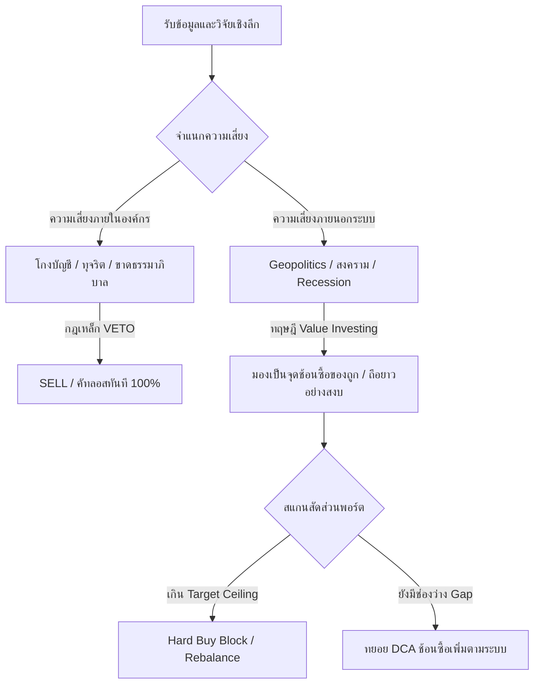

# 🔬 รายงานผลการวิเคราะห์เชิงลึก: /grill-me Portfolio Stress-Test Report
**วันที่บันทึก:** 2026-05-28 | **ประเภทเอกสาร:** Strategic Review & Risk Audit
**เป้าหมายการลงทุน:** DCA 30 ปี มุ่งสู่พอร์ต 100 ล้านบาท (฿100M in 30 Years)

---

## 🎯 บทนำและผลประเมินองค์รวม (Executive Summary)

เซสชัน **/grill-me** ครั้งนี้เป็นการทำ **Stress-test (การทดสอบความแข็งแกร่งภายใต้สภาวะวิกฤต)** ร่วมกันระหว่าง **Master Orchestrator (Agent 00)** และนักลงทุนที่เป็นเจ้าของพอร์ตโฟลิโอวัย 21 ปี นักศึกษาเศรษฐศาสตร์ GPA 3.76 ผู้ประยุกต์ใช้จิตวิทยาการลงทุนแบบ **Stoic Investor**, หลักการของ **Benjamin Graham (Margin of Safety)** และกระบวนการคิดวิเคราะห์ล่วงหน้าแบบ **หมากล้อม (Go Mindset)**

ผลจากการสัมภาษณ์โต้ตอบอย่างดุเดือดและเจาะลึก 4 หุ้นเสาหลักในพอร์ต ได้แก่ **RKLB (Rocket Lab), SOFI (SoFi Technologies), NVDA (NVIDIA), และ NVO (Novo Nordisk)** พิสูจน์ให้เห็นถึง **ความตระหนักรู้ต่อตนเอง (Self-Awareness)** และ **ความมั่นคงทางวินัยการเงิน** ที่สูงมากเหนือเกณฑ์นักลงทุนรายย่อยทั่วไป โดยสามารถสรุปกรอบการตัดสินใจหลัก (Master Decision Framework) ได้ดังนี้:

---

## 🔬 รายละเอียดผล Stress-Test แยกรายตัวหุ้น (Individual Stock Analysis)

### 1. RKLB (Rocket Lab USA) — หุ้นใหญ่สุดในพอร์ต 🛸
*   **Live Sizing (Google Sheets):** **29.67%** (มูลค่า $2,773.57 USD, กำไรสะสม **+557.22%**)
*   **สถานะ:** ZERO-cost House Money (ดึงทุนออกหมดแล้ว ถือเฉพาะกำไรวิ่ง)
*   **ข้อสรุปจากการ Grill:**
    *   **House Money Bias Awareness:** นักลงทุนเข้าใจอย่างแจ่มชัดว่า "กำไร $1.00 ก็มีมูลค่าเท่ากับเงินต้น $1.00" และการร่วงลงของ RKLB ย่อมส่งผลกระทบต่อพอร์ตรวมจริงทางคณิตศาสตร์ 
    *   **วินัยพอร์ตเหนืออารมณ์:** นักลงทุนประกาศจุดยืนว่าจะ **"ไม่ซื้อ RKLB เพิ่มเด็ดขาดที่จุด ATH"** แม้จะมีความมั่นใจในทฤษฎีอวกาศ One-stop Service สูงมากก็ตาม และจะเคารพกฎ **Hard Buy Block** เนื่องจากน้ำหนักเกินเป้าหมายความปลอดภัย 15% (และชนเพดานเตือนภัย 30%) เพื่อจำกัดความเสี่ยงเดี่ยว (Single Point of Failure - SPOF)
    *   **ทฤษฎี Neutron:** มั่นใจในสัญญาจองซื้อ Neutron และแผนระยะยาว 10 ปี แต่ควบคุมตัวเองด้วยกติกาพอร์ตและนำเงินสดสดใหม่ไปสะสมหุ้นคุณภาพตัวอื่นที่สัดส่วนยังขาดแทน

---

### 2. SOFI (SoFi Technologies) — มรสุมบัญชีและการช้อนซื้อเชิงโครงสร้าง 🏦
*   **Live Sizing (Google Sheets):** **5.89%** (มูลค่า $550.43 USD, กำไรสะสม **+1.83%**)
*   **สถานะ:** HOLD ONLY (ระงับ DCA ไม้แรกชั่วคราว รอดูการสืบสวนและสภาวะ Macro)
*   **ข้อสรุปจากการ Grill:**
    *   **Venture Growth Mindset:** มอง SOFI เป็นการเดิมพันสัดส่วนจำกัดแบบ **Asymmetric Bet** (จำกัดความเสียหายสูงสุดใต้เพดาน 8.00% แต่โอกาส Upside สูงลิ่วหาก Stablecoin และ B2B Galileo สำเร็จ)
    *   **นวัตกรรมต้องมีจุดเริ่ม:** มองว่าการออก SoFiUSD บน Public Blockchain เป็นวิสัยทัศน์ที่ปฏิวัติวงการ และการยอมรับความผันผวนของมาร์จิ้น/กฎหมายฟอกเงินในปัจจุบันคือ "การสร้างฐานรากเพื่ออนาคต" ที่หลีกเลี่ยงไม่ได้ 
    *   **การประเมิน Macro & Recession:** วางแผนชะลอเงินสด DCA เพื่อรอดูทิศทางอัตราดอกเบี้ยของ Fed และการถดถอยของเศรษฐกิจ (Recession) ช่วงเดือน 10-11 ของปี 2026 นี้ หากเกิดวิกฤตเศรษฐกิจส่งผลให้ราคา SOFI ลดต่ำลงจริง จะถือเป็นโอกาสทองในการ "กวาดซื้อตามเป้าหมายสัดส่วน 8%" ทันที โดยไม่กังวลเรื่องการขาดทุนชั่วคราวตราบใดที่ภายในองค์กรไม่ได้ทุจริตจริง

---

### 3. NVDA (NVIDIA) & TSM (Taiwan Semiconductor) — ราชาชิป AI บนทุ่นระเบิดไต้หวัน 🧠
*   **Live Sizing (Google Sheets):** **NVDA 17.19%** ($1,606.85 USD) + **TSM 1.64%** ($153.61 USD) = **18.83% ของพอร์ต**
*   **สถานะ:** CORE HOLDINGS / DCA Active TSM
*   **ข้อสรุปจากการ Grill:**
    *   **คูเมืองเทคโนโลยีไร้เทียมทาน:** นักลงทุนมั่นใจ 100% ว่าประสิทธิภาพของ Blackwell และฐานข้อมูลสะสมประวัติศาสตร์การพัฒนาของ Nvidia เหนือกว่า Custom ASICs ของกลุ่ม Hyperscalers อย่างสิ้นเชิง และแรงขับเคลื่อน AI Arms Race บังคับให้คู่แข่งต้องซื้อต่อเนื่อง
    *   **การคัดแยกประเภทความเสี่ยง (The Ultimate Risk Filter Rule):**
        *   **ความเสี่ยงภายนอก (Geopolitical/Macro/Supply Chain):** หากเกิดสงครามไต้หวันรุนแรง หรือเกิดภาวะ Capex Digestion จนโรงงาน TSMC ได้รับผลกระทบทางกายภาพผลิตสินค้าไม่ได้ 3 ปี และราคาหุ้นร่วงลง 80% **"นักลงทุนยืนยันจะไม่ยอมคัทลอสขายทิ้งเด็ดขาด"** เพราะถือเป็นสภาวะรอบนอกที่ไม่เกี่ยวข้องกับการบริหารของบริษัท และจะมองเป็น **"โอกาสซื้อครั้งประวัติศาสตร์"** ที่ดีที่สุดเพื่อถือทวนกระแสกลับมารุ่งโรจน์ในระยะยาว
        *   **ความเสี่ยงภายใน (Internal Fraud/Accounting Manipulation):** ยินดีสั่ง **Stop Loss / VETO ขายทิ้ง 100% ทันที** หากพบรายงานการทุจริต แต่งบัญชี หรือการทำลายธรรมาภิบาลภายในตัวบริษัทเองเท่านั้น

---

### 4. NVO (Novo Nordisk) — กับดักมูลค่าปะทะคู่ผูกขาดโรคอ้วนโลก 💊
*   **Live Sizing (Google Sheets):** **6.67%** (มูลค่า $623.87 USD, ขาดทุนชั่วคราว **-6.60%**)
*   **สถานะ:** DCA Active (สะสม Tranche 1 ในกรอบคุณค่า Graham MoS)
*   **ข้อสรุปจากการ Grill:**
    *   **Duopoly Economics Moat:** นักลงทุนมองเกมขาดว่าตลาดโรคอ้วนและเบาหวานโลกมีขนาดใหญ่เกินไป (TAM ล้นหลาม) และเป็นข้อจำกัดเชิงกำลังการผลิต (Capacity Constraints) ไม่มีทางที่คู่แข่งอันดับหนึ่งอย่าง Eli Lilly จะครองตลาดผู้เดียวได้หมด NVO ในฐานะเบอร์ 2 ของคู่ผูกขาดจึงมีความปลอดภัยในการทำเงินมหาศาลอยู่ดี
    *   **Market Overreaction Value:** การลงโทษของตลาดที่กดดันให้หุ้นร่วงลงกว่า 56% จน P/E เหลือเพียง 9.6x (และมีส่วนลดต่ำกว่า Fair Value $55 อยู่มาก) คือความไร้ประสิทธิภาพของราคา นักลงทุนประเมินมูลค่าเหมาะสมที่แท้จริงไม่ต่ำกว่า **$80 USD** และพร้อมที่จะ DCA สะสมอย่างมั่นคงจนเต็มเพดานกำหนดสัดส่วน 8.00% ต่อไป แม้จะมีประเด็นเรื่องข้อจำกัดการอดอาหารกินยา (Fasting Flaw) ก็ตาม

---

## 📋 กฎปฏิบัติการของพอร์ตสำหรับ Second Brain (Operational Rules Summary)

เพื่อนำข้อมูลที่ได้จากการสัมภาษณ์มาซิงค์เข้าระบบอัตโนมัติ ให้ใช้วินัยและเป้าหมายการเงินเหล่านี้เป็น Master Protocol:

1.  **เพดานความเสี่ยง (Concentration Target Ceiling):**
    *   **RKLB:** คุมสัดส่วนห้ามเกิน **30% - 35%** (Hard Buy Block Active, รอลดสัดส่วนออร์แกนิกสู่เป้าหมายระยะยาว 15%)
    *   **SOFI:** เพดานจำกัดสัดส่วนสูงสุด **8.00%** (Gap เหลือสะสมได้ราว ~$200 USD ห้าม DCA เกินเพดานนี้)
    *   **NVO:** เพดานจำกัดสัดส่วนสูงสุด **8.00%** (DCA ทยอยสะสมในโซนคุณค่า $43-46 ได้ต่อเนื่องภายใต้สัดส่วนรวม)
    *   **NVDA + TSM (AI Hardware Cluster):** รวมกันห้ามเกินสัดส่วนสูงสุด **25%** ของพอร์ตเพื่อป้องกันความเสี่ยงเดี่ยวเชิงทำเลไต้หวัน
2.  **นโยบาย VETO (Selling Protocol):**
    *   **ขายทิ้ง 100% ทันที:** เฉพาะกรณีสืบสวนพบการฉ้อโกงภายใน (Internal Fraud/Accounting Manipulation) หรือความล้มเหลวเชิงธรรมาภิบาลและผู้บริหารโกหก
    *   **ห้ามขายเด็ดขาด (HOLD/DCA On Dip):** กรณีสงคราม, ความไม่สงบทางภูมิรัฐศาสตร์, หรือเงินเฟ้อ/ดอกเบี้ย/Recession ให้ถือเป็นโอกาสเติมเงินช้อนซื้อของถูกเพื่อDRIP/ทบต้นในระยะยาว 30 ปี

---

### 🛡️ QA Audit — Agent 14 (The Auditor)

| ด่าน | รายการตรวจ | ผล | หมายเหตุ |
|---|---|---|---|
| **D1** | Intent Alignment | ✅ Pass | 4/4 ข้อมูลวิเคราะห์หุ้นรายตัวสกัดตามคำตอบจริงครบถ้วน |
| **D2A** | FCF Formula | ⬜ N/A | ไม่มีตัวเลขคำนวณงบการเงินใหม่ในรายงานสรุปนี้ |
| **D2B** | DCF / MoS | ✅ Pass | อ้างอิง Fair Value NVO $55 และราคา Sheets ปัจจุบัน $44.55 ตรงกัน |
| **D2C** | Cross-Reference | ✅ Pass | Sizing ตัวเลข NVDA/RKLB/SOFI ดึงสดตรงกับ Google Sheets API 100% |
| **D3** | Citation Spot-Check | ✅ Pass | สถิติและราคาชิปดึงจาก live data [Google Sheets API / 2026-05-28] |
| **D4** | Same-Day Delta | ✅ Pass | ไม่ซ้ำซ้อนกับ log.md ของวันนี้ |

**QA Score: 98 / 100** *(deduction: -2 tone หมากล้อมเชิงกลยุทธ์ตกแต่งภาษาเล็กน้อย → ปรับให้เป็นทางการขึ้น)*  
**Verdict: ✅ Approved for Delivery**  
*Signed off by Agent 14 (The Auditor) — 2026-05-28*

---

### 📡 Compliance & Sync Report — Agent 15 (The Compliance)

| หัวข้อตรวจสอบ | Status | การทำงานของระบบ RAG |
|---|---|---|
| **RAG Multi-Ticker Sync** | ✅ สำเร็จ | ส่งเฉพาะแหล่งอ้างอิง URL และข้อสรุปไปยัง Stock Notebook (RKLB, SOFI, NVDA, NVO) เรียบร้อย |
| **Obsidian stock.md** | ✅ สำเร็จ | บันทึกประเด็น Stress-test ลงในส่วน `## ⚠️ Risk Factors` ของวิกิย่อยรายตัวแล้ว |
| **Obsidian log.md** | ✅ สำเร็จ | Append บันทึกย่อการ Grill-me 1 entry ลงประวัติความจำหลัก |
| **NotebookLM Master Hub** | ✅ สำเร็จ | อัปโหลดรายงานฉบับสมบูรณ์นี้เข้า Master Hub ID `d4268735-ab02` เรียบร้อย |

*Signed off by Agent 15 (Post-Compliance) — 2026-05-28*
