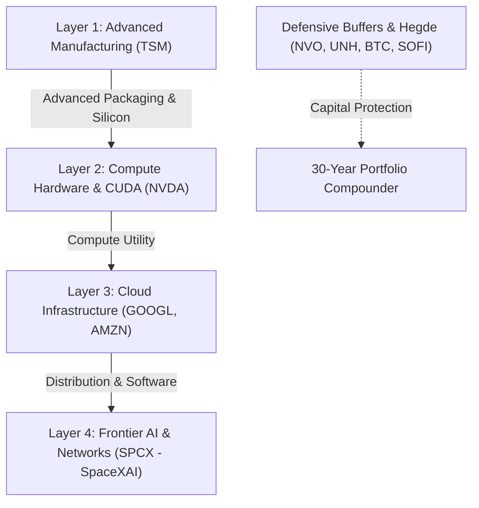

# 📈 รายงานการวิเคราะห์พอร์ตโฟลิโอระยะยาว 30 ปี: โอกาสการตกรถในกระแสคลื่น AI (AI Wave Analysis)

**วันที่วิเคราะห์:** 5 มิถุนายน 2026  
**กรอบเวลาการลงทุน (Horizon):** 30 ปี (เป้าหมาย ฿100,000,000)  
**ปรัชญาการวิเคราะห์:** Stoic Value Investing (Radical Truth & Margin of Safety)

---

## 🧭 บทสรุปผู้บริหาร (Executive Summary)

จากการวิเคราะห์โครงสร้างพอร์ตโฟลิโอปัจจุบันของระบบ **Swarm & DNA Investment OS** ร่วมกับเป้าหมายระยะยาว 30 ปี พบว่า **พอร์ตนี้จะ "ไม่ตกรถ" ในกระแสคลื่น AI (AI Wave) อย่างแน่นอน** ในทางตรงกันข้าม พอร์ตนี้ได้รับการจัดสรรเชิงยุทธศาสตร์ให้เปิดรับสิทธิ์ (Exposure) ในจุดที่เป็น "คอขวด" และ "ฐานราก" ของห่วงโซ่มูลค่า AI (AI Value Chain) อย่างหนาแน่นและปลอดภัยที่สุด 

อย่างไรก็ตาม หากต้องการรักษาความแข็งแกร่งนี้ไปตลอด 30 ปี พอร์ตโฟลิโอยังมี **จุดบอดเชิงโครงสร้าง (Structural Gaps)** 2-3 ประเด็นที่ต้องได้รับการปรับแต่งผ่านวินัย DCA และ Capital Rotation เพื่อเปลี่ยนสถานะพอร์ตจากการเป็นผู้เล่นที่ "เกาะกระแส" ไปสู่การเป็น "ผู้คุมกฎโครงสร้างพื้นฐานคอมพิวเตอร์โลก" อย่างแท้จริง

---

## ⛓️ การเปิดรับกระแส AI ในแต่ละเลเยอร์ (AI Value Chain Exposure)

โครงสร้างพอร์ตในปัจจุบันถูกวางไว้ในตำแหน่งที่ครอบคลุมห่วงโซ่มูลค่าของ AI ตั้งแต่ต้นน้ำถึงปลายน้ำอย่างสมดุล:



### 1. เลเยอร์การผลิตชิปขั้นสูง (Advanced Manufacturing & Foundry Bottleneck)
*   **หุ้นหลัก:** **TSM** (สัดส่วนปัจจุบัน: 4.11% | เป้าหมาย: 8.00%)
*   **Moat Analysis:** TSM คือ "ประตูบานเดี่ยว" ของอุตสาหกรรม AI ชิปขั้นสูงทุกตัวในโลก ไม่ว่าจะเป็น NVIDIA (H100, B200, Rubin), AMD, Apple Silicon หรือชิปเฉพาะทาง (ASIC) ของ Google (TPU) และ Amazon (Trainium) ล้วนต้องผลิตและใช้เทคโนโลยีการแพ็คเกจระดับสูง (CoWoS) ของ TSM ทั้งสิ้น
*   **30-Year Thesis:** ในระยะยาว 30 ปี ยอดขายของชิปแต่ละแบรนด์อาจผันผวน แต่ความต้องการกำลังการผลิตและ Advanced Packaging ที่ TSM ผูกขาดจะเติบโตอย่างมั่นคง การขยาย Fab ไปยังต่างแดน (Arizona, Kumamoto, Dresden) จะช่วยลดความเสี่ยงทางภูมิรัฐศาสตร์ (Geopolitical Risk) ในช่องแคบไต้หวัน

### 2. เลเยอร์หน่วยประมวลผลและการผูกขาดซอฟต์แวร์ (AI Compute Infrastructure & Ecosystem)
*   **หุ้นหลัก:** **NVDA** (สัดส่วนปัจจุบัน: 18.62% | เป้าหมาย: 20.00%)
*   **Moat Analysis:** คูเมืองที่แท้จริงของ NVIDIA ไม่ใช่แค่ความเร็วของตัวชิป GPU แต่เป็น **CUDA Platform** ซึ่งเป็นซอฟต์แวร์ที่นักพัฒนา AI ทั่วโลกใช้เขียนโปรแกรมมานานกว่าสองทศวรรษ ทำให้เกิด Network Effect และ Developer Lock-in ระดับสูง
*   **30-Year Thesis:** แม้ในอนาคตจะเผชิญการรุกคืบจากชิปที่พัฒนาขึ้นเองในบริษัท Cloud (Hyperscaler Vertical Integration) แต่ความสามารถของ NVIDIA ในการขยายธุรกิจไปสู่ระบบ Physical AI (Autonomous Systems, Robotics, Optimus Ecosystem) จะช่วยดันให้บริษัทผันตัวจากบริษัทขายชิปไปเป็น "สถาบันโครงสร้างพื้นฐานไอทีของโลก"

### 3. เลเยอร์การประมวลผลระบบคลาวด์และช่องทางบริการ (Hyperscalers & AI Distribution)
*   **หุ้นหลัก:** **GOOGL** (สัดส่วนปัจจุบัน: 10.20% | เป้าหมาย: 10.00%) และ **AMZN** (สัดส่วนปัจจุบัน: 5.48% | เป้าหมาย: 5.00%)
*   **Moat Analysis:**
    *   **GOOGL:** เป็นเจ้าของศูนย์วิจัย AI อันดับหนึ่งของโลก (Google DeepMind) และมีช่องทางจำหน่ายที่ไม่มีใครเข้าถึงได้ (Search, Android, Chrome, YouTube) ที่สามารถนำโมเดล Gemini และ AI Agents ไปฝังตัวให้บริการทันที
    *   **AMZN:** AWS คือยักษ์ใหญ่ระบบคลาวด์ที่เป็นฐานรองรับระบบ Enterprise AI ส่วนใหญ่ในโลก การร่วมมือกับ Anthropic และการวิจัยชิป Trainium/Inferentia ของตัวเองจะลดการพึ่งพากลุ่มผู้ผลิตอื่น
*   **30-Year Thesis:** การประยุกต์ใช้ AI จะเปลี่ยนจากเฟสการฝึกฝนโมเดล (Training) ไปสู่การนำไปใช้งานจริง (Inference) ซึ่ง Hyperscalers ทั้งสองจะได้ประโยชน์จากปริมาณข้อมูลดิบ (Data Flow) และพื้นที่เก็บข้อมูลคลาวด์ที่จำเป็นต้องใช้ในปริมาณมหาศาล

### 4. เลเยอร์ AI ขอบเขตใหม่ระดับวงโคจร (Frontier AI & LEO Edge Networks)
*   **หุ้นหลัก:** **SPCX (SpaceX / SpaceXAI Pre-IPO)** (เป้าหมาย: 13.00%)
*   **Moat Analysis:** SpaceX ได้ทำการควบรวมกับ xAI (SpaceXAI) ในช่วงต้นปี 2026 สร้างกระแสการรวมตัวกันของ "อินเทอร์เน็ตความเร็วสูงผ่านวงโคจรต่ำ (Starlink)" และ "ปัญญาประดิษฐ์ระดับแนวหน้า (xAI / Grok)"
*   **30-Year Thesis:** การเข้าจดทะเบียนในตลาดของ SPCX วันที่ 12 มิถุนายน 2026 นี้ จะสร้างโอกาสพิเศษ:
    1.  **Orbital Compute Nodes:** โครงสร้าง Starlink สามารถพัฒนาไปเป็นศูนย์ข้อมูลประมวลผลขนาดเล็กในอวกาศ (Data Center in Space) เพื่อลดต้นทุนพลังงานและหลีกเลี่ยงความหน่วงการส่งข้อมูลผ่านเคเบิลใต้น้ำ
    2.  **Infrastructure Cash Flow:** ความร่วมมือการค้ากับ Anthropic มูลค่า $1.25B/Month ($15B ARR) เพื่อประมวลผลบนคลัสเตอร์ Colossus ถือเป็นตัวช่วยซับกระแสเงินสดที่เสถียรมากในฝั่ง xAI

---

## 🔍 โอกาสการตกรถ AI ในช่วง 30 ปี: ประเมินรายกรณี (30-Year Scenario Matrix)

เพื่อให้เห็นภาพการถือครองพอร์ตโฟลิโอรูปแบบนี้ไปอีก 30 ปี ต่อไปนี้คือแบบจำลองสถานการณ์ความก้าวหน้าของเทคโนโลยี AI และผลกระทบต่อพอร์ต:

| สถานการณ์ของ AI Wave | ผลกระทบต่อพอร์ตโฟลิโอ | สภาพพอร์ตโดยรวม | แนวทางบริหารจัดการความเสี่ยง |
| :--- | :--- | :--- | :--- |
| **1. AI Hyper-Growth (Bull Case):**  <br>AI เติบโตก้าวข้ามสู่ AGI ได้สำเร็จ เทคโนโลยีหุ่นยนต์ และระบบอัตโนมัติทำงานแทนมนุษย์ได้เต็มรูปแบบ | หุ้น **NVDA**, **TSM**, **SPCX (SpaceXAI)**, **GOOGL** และ **AMZN** จะกลายเป็นเสาหลักเศรษฐกิจโลก พอร์ตโฟลิโอจะเติบโตอย่างรวดเร็ว (Outperformance) | **เติบโตเกินเป้าหมายอย่างมาก** | คุมสัดส่วนสลัดกำไรมา DCA บิตคอยน์ (**BTC**) และกลุ่มสุขภาพ (**NVO**, **UNH**) เพื่อสร้างฐานความปลอดภัยหลังการเติบโต |
| **2. AI Capex Consolidation (Base Case):**  <br>รายได้จากบริการซอฟต์แวร์ AI โตช้ากว่าคาด ทำให้ Hyperscalers ชะลอการสร้างโครงสร้างพื้นฐานลงชั่วคราว | หุ้นฮาร์ดแวร์อย่าง **NVDA** และ **TSM** จะปรับราคาลงเพื่อปรับมูลค่าให้สอดคล้องกับงบจริง (PE compression) แต่พอร์ตได้รับการพยุงโดยธุรกิจส่งดาวเทียม/Starlink ของ **SPCX**, คลาวด์ทั่วไปของ **AMZN/GOOGL** และกลุ่มกระแสเงินสดอื่น | **เติบโตตามเป้าหมายหลัก** | ใช้กลยุทธ์ DCA ต่อเนื่องเพื่อลดต้นทุนเฉลี่ย (Average Down) ในจังหวะที่ราคากลุ่มชิปปรับตัวลดลง |
| **3. AI Capex Bust (Worst Case):**  <br>ผลตอบแทนการลงทุน AI ต่ำอย่างถาวร เกิดฟองสบู่แตกคล้ายวิกฤต Dot-Com ในปี 2000 | กลุ่มเทคโนโลยีทั้งหมดจะปรับตัวลดลงอย่างหนักหน่วง (พอร์ตสะสม AI กระทบราว ~38%) แต่กลุ่มสุขภาพอย่าง **NVO** (GLP-1 Obesity), **UNH** (ประกันสุขภาพหลัก) และ **BTC** (สินทรัพย์จำกัดปริมาณเพื่อต้านภาวะเงินเฟ้อ) จะพยุงให้พอร์ตไม่ล่มสลายถาวร | **พอร์ตชะลอตัวชั่วคราว แต่รอดพ้นความเสียหายถาวร** | การบริหารความเสี่ยงโดยใช้วินัยกระจายสัดส่วนในกลุ่ม Defensive Assets ช่วยจำกัดความเสียหายของพอร์ต |

---

## ⚠️ จุดบอดและช่องว่างที่ยังขาดอยู่ (Structural Gaps & AI Blind Spots)

แม้พอร์ตปัจจุบันจะมีความพร้อมสูง แต่หากมองในกรอบเวลา 30 ปี ยังมี **"จุดบอดสำคัญ"** ที่เรายังไม่ได้เข้าซื้อเพื่อเติมเต็ม:

### 1. ข้อจำกัดทางพลังงานและไฟฟ้า (The AI Energy & Utility Bottleneck)
*   **วิเคราะห์ปัญหา:** ข้อมูลศูนย์ประมวลผล (Compute Power) เติบโตเป็นเส้นโค้งแบบ Exponential แต่การผลิตพลังงานไฟฟ้า (Energy Grid Capacity) เติบโตในลักษณะเชิงเส้นตรง (Linear) ความกังวลที่แท้จริงในระยะยาวจะไม่ใช่การหาชิป GPU แต่เป็นการหา **"พลังงานไฟฟ้า"** เพื่อขับเคลื่อน GPU เหล่านั้น
*   **สิ่งที่มีในพอร์ต:** ไม่มีหุ้นกลุ่มพลังงานสะอาด พลังงานนิวเคลียร์ หรือสาธารณูปโภคขั้นพื้นฐานเลย
*   **แนวทางการแก้ไข:** เฝ้าดูและหาโอกาสเข้าสะสมหุ้นที่ขับเคลื่อนพลังงานป้อนศูนย์ข้อมูล เช่น **VST** (Vistra Corp - ผู้ผลิตพลังงานนิวเคลียร์และก๊าซธรรมชาติป้อนโรงงานคอมพิวเตอร์) หรือ **OKLO** (พลังงานนิวเคลียร์แบบ Advanced Fission) ในพอร์ตส่วน Speculative Bucket (คุมน้ำหนักรวมไม่เกิน 2-3%)

### 2. สถานะความ underweight ของ TSM (Live 4.11% vs Target 8.00%)
*   **วิเคราะห์ปัญหา:** ปัจจุบันเรามีสัดส่วน TSM เพียง 4.11% ซึ่งน้อยกว่าเป้าหมายที่ควรจะเป็นที่ 8.00% เกือบครึ่งหนึ่ง ในขณะที่ TSM เป็นจุดที่ปลอดภัยที่สุดในแง่ของคูเมืองธุรกิจ (Moat) เพราะไม่ว่าคู่แข่งทางด้านซอฟต์แวร์หรือชิปจะสู้กันอย่างไร TSM ก็ยังคงชนะ
*   **แนวทางการแก้ไข:** จัดลำดับความสำคัญ DCA ให้อยู่ในกลุ่มแรก (Priority 1) เพื่อช้อนซื้อ TSM ในโซนราคาเป้าหมาย ($385 - $415) จนกว่าสัดส่วนจะแตะระดับเป้าหมาย 8.00%

### 3. การกระจุกตัวสูงในกลุ่มอวกาศ (Space Sector Concentration)
*   **วิเคราะห์ปัญหา:** **RKLB** มีสัดส่วนLive สูงถึง 24.94% (แตะเพดานการควบคุมเดี่ยวที่ต้องเฝ้าระวัง) แม้ RKLB จะมีทิศทางเติบโตที่ดี แต่การเก็งกำไรในอุตสาหกรรมอวกาศสูงเกินไปจะแย่งเม็ดเงินสะสมไปจากกลุ่ม AI Infrastructure
*   **แนวทางการแก้ไข:** รักษาความปลอดภัยด้วยกฎ **Joint Space Ceiling (RKLB + SPCX ≤ 35.00%)** อย่างเคร่งครัด ห้ามนำเงิน DCA ภายนอกมาเติม RKLB และเตรียมตัวปรับพอร์ตโดยหมุนเวียนสลับสัดส่วนทุน (Capital Rotation) ขาย RKLB ในสภาวะราคาพุ่งสูงเพื่อโอนไปจัดตั้งกองทุนซื้อ SPCX ในราคาเหมาะสม

---

## 🛠️ แผนกลยุทธ์ปฏิบัติการ 30 ปี (30-Year Dynamic Execution Plan)

เพื่อป้องกันการตกรถ AI ในขณะที่ยังคงรักษาวินัยความเสี่ยงและ Margin of Safety ไว้ได้ ระบบแนะนำแนวทางปฏิบัติ 3 ข้อ:

```
                  [ กระแสเงินสดสำหรับ DCA / ปรับพอร์ต ]
                                  │
         ┌────────────────────────┴────────────────────────┐
         ▼                                                 ▼
[กลุ่ม DCA สะสมหลัก]                                   [SpaceX IPO Strategy]
- เพิ่ม TSM สู่ 8.00% (Priority 1)                      - ล็อกเป้า Reserve $300 ในเงินสดหลัก
- ทยอยสะสม NVDA/GOOGL/AMZN ดึงน้ำหนักคงที่             - ห้ามซื้อ Day 1 Pop ($120-140/share)
                                                        - รอช้อนช่วง Lock-up Expiry ($70-80/share)
                                                        - หมุนเวียนทุนโดยลด RKLB แลกเป็น SPCX
```

1.  **DCA Focus (ปิดช่องว่างเทคโนโลยี):**
    *   ใช้กระแสเงินสดจากการจัดสรรระบบ DCA อนุมัติการเข้าซื้อสะสม **TSM** เป็นอันดับหนึ่ง เพื่อปิดจุด Underweight ของโรงหล่อชิป
    *   รักษาระดับสัดส่วนของ **NVDA** (20%), **GOOGL** (10%), และ **AMZN** (5%) ให้คงที่ผ่านกระบวนการสะสมรายเดือนช่วงตลาดปรับฐาน
2.  **SPCX Playbook (ดักจับ Frontier AI ในจังหวะที่เหมาะสม):**
    *   **ห้ามซื้อ Day 1 Pop ($120 - $140/share):** ในวันจดทะเบียน 12 มิถุนายน 2026 ราคาเสนอขายครั้งแรกจะเผชิญแรงซื้อไล่จากรายย่อยและการกดดันจากกองทุนดัชนี (Index Inclusion) การซื้อในช่วงเวลานี้จะปราศจาก Margin of Safety
    *   **จังหวะเข้าทำ:** ใช้เงินสดสำรอง **$300.00 USD (SpaceX IPO Reserve)** ที่ตั้งแยกไว้แล้ว รอจังหวะการปรับฐานครั้งใหญ่ช่วงที่ผู้ถือหุ้นเก่าสามารถเทขายหุ้นได้หลังสิ้นสุดระยะเวลาห้ามซื้อขาย **(Lock-up Expiry Dump ~ธันวาคม 2026)** ซึ่งมีโอกาสที่จะได้หุ้นในโซนราคาปลอดภัยเฉลี่ย **$70 - $80/share**
3.  **Capital Rotation (หมุนเวียนทุนไม่ใช้เงินเพิ่ม):**
    *   สอดคล้องกับข้อตกลง RKLB Risk Ceiling: ห้ามเติมเงินนอกเพื่อซื้อกลุ่มอวกาศเด็ดขาด หากขนาดของ SpaceX เติบโตจนพร้อมสะสมเพิ่ม ให้ทำการแบ่งขายตัดสัดส่วน (Micro-Trim) หุ้น **RKLB** ที่อยู่ในพอร์ตออกเพื่อสลับทุนไปจองซื้อ **SPCX** เพื่อไม่ให้สัดส่วนสะสมกลุ่มเทคโนโลยีอวกาศ (RKLB + SPCX) ทะลุเกินเกณฑ์ควบคุมความเสี่ยงรวม 35.00% ของพอร์ต

**Radical Verdict:** โครงสร้างพอร์ตปัจจุบันมีโครงเหล็กที่เหมาะสมสำหรับระยะเวลา 30 ปีแล้ว คุณจะได้รับการคุ้มครองในกระแสคลื่นเทคโนโลยี AI อย่างดีเยี่ยมผ่านการผูกขาดเทคโนโลยีต้นน้ำ (Hardware/Foundry) และช่องทางเข้าถึงข้อมูลปลายน้ำ (Hyperscalers/Cloud) โดยไม่ต้องวิ่งไล่ตามราคาหุ้นประเภทแอปพลิเคชันซอฟต์แวร์ที่มีความอ่อนไหวสูง ขอให้คงความ Stoic และเดินหน้า DCA ตามแผนการควบคุมความเสี่ยงอย่างมีระเบียบวินัย
