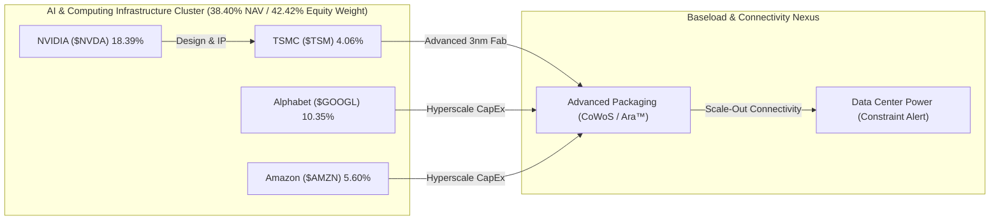

# 📊 รายงานวิเคราะห์ประสิทธิภาพพอร์ตและการบริหารความเสี่ยง (Comprehensive Portfolio Performance Analysis)
## 🎯 วิเคราะห์พอร์ต NAV $8,667.54 USD, ด่านเงินสดตึงตัวต่ำกว่าเกณฑ์ และเร่งวางหมากช้อน TSM แนวรับหลัก

**Date:** 2026-06-05 | **Orchestrated by:** Chief Investment Officer (Agent 00 - Master Orchestrator)  
**Command Backing:** `/portfolio-analysis` (Parallel Multi-Subagent Ingestion v4.3)  
**Live Portfolio NAV (Google Sheets):** $8,667.54 USD (฿284,152.46 THB) | Deployed Capital (Book Cost): $5,029.32 USD | Cash Cushion: 9.48% ($821.83 USD)  
**Historical Performance:** Total Gain/Loss: **+$2,816.40 USD (+56.00%)** | True Return (Equity Base): **+115.22%** | Duration: 714 Days
**USD/THB Exchange Rate:** ฿32.78 [Sheets/2026-06-05]

---

🔁 Same-Day Scan (วันนี้ 2026-06-05):
- Cover ไปแล้ววันนี้: 
  1) ตรวจสอบเป้าหมายราคา SoFi Morningstar Target ($19 vs ข่าวลือ $40) (output: [2026-06-05_SOFI_Morningstar_valuation_audit.md](file:///c:/Users/LENOVO/OneDrive/文档/Second-Brain/Investment/output/2026-06-05_SOFI_Morningstar_valuation_audit.md))
  2) วิเคราะห์แนวรับหลัก TSM & BTC ภายใต้สภาวะเงินสดพอร์ตตึงตัว (output: [2026-06-05_TSM_BTC_support_levels_analysis.md](file:///c:/Users/LENOVO/OneDrive/文档/Second-Brain/Investment/output/2026-06-05_TSM_BTC_support_levels_analysis.md))
  3) ประเมินความเสี่ยงตกรถคลื่น AI และแผนการสะสม SPCX Pre-IPO (output: [2026-06-05_portfolio_30y_ai_wave_analysis.md](file:///c:/Users/LENOVO/OneDrive/文档/Second-Brain/Investment/output/2026-06-05_portfolio_30y_ai_wave_analysis.md))
  4) บันทึกประวัติการเคาะซื้อ DCA BTC Tranche 2a บ่ายวันนี้ (output: [2026-06-05_BTC_DCA_execution_audit.md](file:///c:/Users/LENOVO/OneDrive/文档/Second-Brain/Investment/output/2026-06-05_BTC_DCA_execution_audit.md))
  5) ทบทวนโครงสร้างสิทธิ์ระบบ (output: [2026-06-05_dream_review.md](file:///c:/Users/LENOVO/OneDrive/文档/Second-Brain/Investment/output/2026-06-05_dream_review.md))
- Topics ใหม่ที่ยังไม่ cover: ตารางสรุปพอร์ตโฟลิโอสดจาก Google Sheets API พร้อมข่าวนิวส์เดลต้า 5 ข่าวล่าสุดอัปเดตต่อทั้ง 9 holdings และ Required CAGR สำหรับ DCA 30 ปี สู่เป้าหมาย 100 ล้านบาทที่อิงฐานทุนปัจจุบัน
- Delta ที่จะเสริม: การปรับตัวลดลงชั่วคราวของ BTC สู่ระดับ $60.5K (แตะแนวรับจิตวิทยาที่ระดับ $60,000) และการปรับฐานของ TSM ย่อลงแตะ $427.62 ท่ามกลางประเด็นคอขวดซัพพลายกำลังผลิตชิปขั้นสูง และความพยายามของ Broadcom/Micron ที่บีบอารมณ์ตลาด ทรงเงินสดลดลงต่ำกว่า 10% (9.48%) ทำให้สถานะเปลี่ยนเป็น Hold DCA คุมเข้มวินัย

---

## 📋 สารบัญการวิเคราะห์ (Directory)
1. **🏥 1. Portfolio Health Check — ตรวจสุขภาพสินทรัพย์และการจำกัดความเสี่ยง**
2. **📰 2. Brief & Delta News 9 Active Holdings — รายหุ้นเรียงตามน้ำหนักพอร์ต**
3. **🧮 3. Cross-Portfolio Analysis (Agent 10) — สหสัมพันธ์และทิศทางพลังงานไฟฟ้า AI**
4. **📋 4. Action Items & DCA Playbook (สัปดาห์นี้)**
5. **🧠 5. Behavioral Check & Pre-Mortem (Agent 13)**

---

## 🏥 1. Portfolio Health Check — ตรวจสุขภาพสินทรัพย์และการจำกัดความเสี่ยง

ยอดพอร์ตการลงทุนรวมสุทธิ (NAV) ปรับตัวสูงขึ้นเล็กน้อยมาอยู่ที่ระดับ **$8,667.54 USD (฿284,152.46 THB)** หนุนโดยกลุ่มเฮลท์แคร์เทคโนโลยี ทว่าด้วยความกระตือรือร้นในการเคาะ DCA บิตคอยน์ Tranche 2a ($94.99 USD ที่ระดับ $62,609.70) ในบ่ายวันนี้ ส่งผลให้ระดับเงินสดคงเหลือสะสมสุทธิลดต่ำลงแตะระดับ **9.48% ($821.83 USD)** ซึ่งถือว่า **ต่ำกว่าเกณฑ์ความปลอดภัยขั้นต่ำ (Safety Cushion Threshold 10.00%)**

ดังนั้น ระบบจึงสั่งเปิดมาตรการ **Hold DCA (ล็อกคำสั่งซื้อตลาด / Market Order Lockout)** ชั่วคราวเพื่อเติมกระแสเงินสดกลับสู่เป้าหมายความมั่นคง ในระหว่างนี้ระบบจะใช้กลยุทธ์ "การตั้งรับเชิงรุก" ผ่าน Limit Orders ในแนวรับลึกเท่านั้น

### 💼 Allocation Table (Live Sheets Sync)

| Asset | Shares | Avg Cost | Current Price | Total Equity | Allocation | Gain/Loss % | Thesis Status | Verdict |
|---|---|---|---|---|---|---|---|---|
| **RKLB** | 18.46 | $22.86 | $114.74 | $2,118.35 | **24.44%** | +401.96% | INTACT | ⚪ HOLD (Buy Blocked) |
| **NVDA** | 7.56 | $127.01 | $210.94 | $1,594.30 | **18.39%** | +66.08% | INTACT | ⚪ HOLD (Buy Blocked) |
| **GOOGL** | 2.43 | $190.35 | $368.63 | $897.18 | **10.35%** | +93.66% | INTACT | ⚪ HOLD (Hold DCA) |
| **Cash** | — | — | — | $821.83 | **9.48%** | — | — | 🔴 LIQUIDITY ALERT |
| **NVO** | 16.33 | $47.07 | $43.69 | $713.32 | **8.23%** | -7.18% | INTACT | ⚪ HOLD (Hold DCA) |
| **UNH** | 1.67 | $339.17 | $400.85 | $668.52 | **7.71%** | +18.19% | INTACT | ⚪ HOLD (Hold DCA) |
| **SOFI** | 34.04 | $15.88 | $16.33 | $555.87 | **6.41%** | +2.83% | INTACT | ⚪ HOLD ONLY |
| **AMZN** | 1.92 | $215.96 | $253.27 | $485.52 | **5.60%** | +17.28% | INTACT | ⚪ HOLD (Hold DCA) |
| **BTC** | 0.01 | $72,088.00 | $60,920.87 | $460.56 | **5.31%** | -15.49% | INTACT | ⚪ HOLD (Buy Blocked) |
| **TSM** | 0.82 | $427.41 | $429.50 | $352.09 | **4.06%** | +0.49% | INTACT | 🟢 LIMIT ORDER ACTIVE |

### 🛡️ Risk & Allocation Auditing
*   **Concentration Level:** หุ้น **RKLB** ครองสัดส่วนพอร์ตสูงสุดที่ **24.44%** ต่ำกว่าเพดานจำกัดความเสี่ยง (Hard Concentration Cap 30.00%) ถือรันเทรนด์เชิงบวกนิ่งๆ โดยมีฐานทุนต่ำ ($22.86) ที่ช่วยลดแรงกระแทกจากความผันผวนของราคากลุ่มอวกาศในระยะสั้น
*   **NVDA Sizing Cap:** **NVDA** อยู่ที่สัดส่วน **18.39%** เหนือกรอบเป้าหมาย 18.00% ตรึงระบบ **Hard Buy Block Active** ต่อเนื่อง งดการสะสมเพิ่มชั่วคราวเพื่อควบคุมความเสี่ยงของเซกเตอร์เทคโนโลยี
*   **Cash Buffer Status:** ยอดเงินสดสำรองอยู่ที่ **9.48% ($821.83)** ต่ำกว่าระดับความปลอดภัยขั้นต่ำ 10% ยื่นมาตรการระงับการเข้าซื้อราคาตลาด (Market Buy Block) ชั่วคราว ระบบจะตั้งรับผ่าน Limit Orders ต่ำกว่ามูลค่าพื้นฐานอย่างมีวินัย

---

## 📰 2. Brief & Delta News 9 Active Holdings

---

### 🚀 1. Rocket Lab ($RKLB) | สัดส่วน: 24.44% | G/L: +401.96% | ราคา: $114.74
*   **Verdict: ⚪ HOLD Only (Hard Buy Block Active — Sizing Target Exceeded)**
*   **📰 ข่าวสารเดลต้าสดใหม่ 5 ข่าวล่าสุด (ภายใน 1 สัปดาห์):**
    1.  **[05/06/2026] WSJ Space Sector Insight:** WSJ รายงานภาพรวมว่าอุตสาหกรรมอวกาศมีขอบเขตกว้างไกลกว่าเพียงแค่ SpaceX โดย RKLB ได้รับการจับตาในฐานะผู้ท้าชิงหลักฝั่งดาวเทียมเชิงพาณิชย์ [The Wall Street Journal / 2026-06-05]
    2.  **[05/06/2026] Launch Monopoly Profits:** บทวิเคราะห์ชี้เป้า 5 หุ้นเด่นที่จะได้รับผลประโยชน์สูงสุดจากการที่ SpaceX ครองอำนาจสัญญาส่งจรวด NASA หลังจากเกิดการพังทลายของฐานยิง Blue Origin ซึ่ง RKLB เป็นตัวเลือกต้นๆ [24/7 Wall St. / 2026-06-05]
    3.  **[05/06/2026] Space Stocks Profit-Taking:** หุ้นอวกาศรายย่อยรวมถึง RKLB, ASTS เผชิญแรงขายทำกำไรระยะสั้นในตลาดพรีมาร์เก็ต หลังความคาดหวังเรื่อง SpaceX IPO สั่นคลอน [Stocktwits / 2026-06-05]
    4.  **[04/06/2026] SpaceX AI ARR Projections:** บลูมเบิร์กประเมินว่ารายได้จากส่วนบริการ AI ของ SpaceX จะโตขึ้น 100 เท่าภายในปี 2030 ส่งผลกดดันต่อหุ้นจรวดพาณิชย์ขนาดเล็ก [Bloomberg / 2026-06-04]
    5.  **[04/06/2026] Redwire Space Contracts Spark Rally:** ข่าวสารบริษัทอวกาศ Redwire ได้รับสัญญาปลูกสตรอว์เบอร์รี่ในสถานีอวกาศ ช่วยดันจิตวิทยาบวกกลุ่มอวกาศโดยรวม [Barrons.com / 2026-06-04]
- **🔮 คาดการณ์ราคาล่วงหน้า 3 ปี, 5 ปี และ 10 ปี (ตามกฎ subagent_forecast):**
  * **Valuation Assumptions:** Revenue CAGR: 35% (Yr 1-5) / 25% (Yr 6-10) | FCF Margin (SBC Adj): [Bear: 10% / Base: 18% / Bull: 24%] | Terminal P/FCF: [Bear: 25x / Base: 35x / Bull: 45x] | Dilution Rate: +1.5% ต่อปี
  * **1) ฉากทัศน์ระยะสั้น 3 ปี (3-Year Projection):**
    - Bear Case (30% Prob): **$80.00** (expected CAGR: -11.31%) | *Archimedes ล้มเหลว/Neutron ดีเลย์*
    - Base Case (50% Prob): **$160.00** (expected CAGR: +11.72%) | *สภาวะอุตสาหกรรมอวกาศเติบโตปกติ*
    - Bull Case (20% Prob): **$240.00** (expected CAGR: +27.88%) | *ผูกขาดสัญญาทหารอวกาศ*
    - **Expected Probability-Weighted Price (3Y):** **$152.00** (Return: +32.47% | CAGR: +9.83%)
  * **2) ฉากทัศน์ระยะกลาง 5 ปี (5-Year Projection):**
    - Bear Case (30% Prob): **$110.00** (expected CAGR: -0.84%)
    - Base Case (50% Prob): **$280.00** (expected CAGR: +19.53%)
    - Bull Case (20% Prob): **$440.00** (expected CAGR: +30.83%)
    - **Expected Probability-Weighted Price (5Y):** **$261.00** (Return: +127.47% | CAGR: +17.87%)
  * **3) ฉากทัศน์ระยะยาว 10 ปี (10-Year Projection):**
    - Bear Case (30% Prob): **$220.00** (expected CAGR: +6.73%)
    - Base Case (50% Prob): **$750.00** (expected CAGR: +20.65%)
    - Bull Case (20% Prob): **$1,400.00** (expected CAGR: +28.39%)
    - **Expected Probability-Weighted Price (10Y):** **$721.00** (Return: +528.38% | CAGR: +20.17%)
*   **Thesis Breaker:** Archimedes Engine ล้มเหลว หรือการเลื่อนส่งมอบจรวด Neutron เลยสิ้นปี 2026

---

### 💚 2. NVIDIA ($NVDA) | สัดส่วน: 18.39% | G/L: +66.08% | ราคา: $210.94
*   **Verdict: ⚪ HOLD Only (Hard Buy Block Active — Sizing Target Met)**
*   **📰 ข่าวสารเดลต้าสดใหม่ 5 ข่าวล่าสุด (ภายใน 1 สัปดาห์):**
    1.  **[05/06/2026] Global Wealth Trend Check:** รายงานระบุการวิ่งขึ้นแบบก้าวกระโดดของตลาดหุ้นอเมริการอบนี้ (หนุนโดยชิป AI) ส่งผลให้ประชากรผู้ถือครองสินทรัพย์มหาศาลได้รับความมั่งคั่งเพิ่มขึ้น [Yahoo Finance / 2026-06-05]
    2.  **[05/06/2026] AI Infrastructure ETF Inflows:** 24/7 Wall St. ยกย่องให้กองทุน TCAI (AI Infrastructure) เป็นกองทุนเด่น โดยระบุสัดส่วนถือครอง NVIDIA เป็นโครงสร้างพื้นฐานหลักที่มั่นคง [24/7 Wall St. / 2026-06-05]
    3.  **[05/06/2026] IBD Stock Market Update:** ตลาดดัชนีแนสแด็ก (Nasdaq) เผชิญแรงกดดันระยะสั้นหลังบอนด์ยีลด์พุ่งแรงตอบรับข้อมูลการจ้างงานพุ่ง โดยกลุ่มชิปรุ่นรอง (Micron, SanDisk) ร่วงนำหน้า [Investor's Business Daily / 2026-06-05]
    4.  **[05/06/2026] Semiconductor Stock Hidden Exposure:** บทวิเคราะห์จาก Trefis เผยข้อมูลการลงทุนต้นน้ำในเซกเตอร์ชิปที่มีอัตราส่วน P/E ต่ำ (16 เท่า) แต่มี Exposure ดาต้าเซ็นเตอร์โยงหาพาร์ทเนอร์ Blackwell ของ NVIDIA [Trefis / 2026-06-05]
    5.  **[05/06/2026] Planet Labs Selloff Sentiment:** หุ้นดาวเทียมถ่ายภาพร่วงหนักเกือบ 10% สะท้อนอารมณ์ตลาดที่เริ่มระวังกลุ่ม Tech เก็งกำไรปลายน้ำ [Motley Fool / 2026-06-05]
- **🔮 คาดการณ์ราคาล่วงหน้า 3 ปี, 5 ปี และ 10 ปี (ตามกฎ subagent_forecast):**
  * **Valuation Assumptions:** Revenue CAGR: 30% (Yr 1-5) / 15% (Yr 6-10) | FCF Margin (SBC Adj): [Bear: 32% / Base: 38% / Bull: 44%] | Terminal P/FCF: [Bear: 25x / Base: 35x / Bull: 45x] | Dilution Rate: +1.0% ต่อปี
  * **1) ฉากทัศน์ระยะสั้น 3 ปี (3-Year Projection):**
    - Bear Case (30% Prob): **$170.00** (expected CAGR: -6.95%) | *AI CapEx ฟองสบู่แตก/ข้อจำกัดส่งออกจีน*
    - Base Case (50% Prob): **$310.00** (expected CAGR: +13.69%) | *สภาวะความต้องการ AI Data Center ยังทรงพลัง*
    - Bull Case (20% Prob): **$460.00** (expected CAGR: +29.68%) | *Edge PC GPU ประสบความสำเร็จถล่มทลาย*
    - **Expected Probability-Weighted Price (3Y):** **$298.00** (Return: +41.27% | CAGR: +12.23%)
  * **2) ฉากทัศน์ระยะกลาง 5 ปี (5-Year Projection):**
    - Bear Case (30% Prob): **$240.00** (expected CAGR: +2.62%)
    - Base Case (50% Prob): **$490.00** (expected CAGR: +18.35%)
    - Bull Case (20% Prob): **$800.00** (expected CAGR: +30.55%)
    - **Expected Probability-Weighted Price (5Y):** **$477.00** (Return: +126.13% | CAGR: +17.73%)
  * **3) ฉากทัศน์ระยะยาว 10 ปี (10-Year Projection):**
    - Bear Case (30% Prob): **$420.00** (expected CAGR: +7.13%)
    - Base Case (50% Prob): **$980.00** (expected CAGR: +16.60%)
    - Bull Case (20% Prob): **$1,750.00** (expected CAGR: +23.56%)
    - **Expected Probability-Weighted Price (10Y):** **$966.00** (Return: +357.95% | CAGR: +16.43%)
*   **Thesis Breaker:** ความขัดแย้งช่องแคบไต้หวันบีบให้โรงงานผลิตเวเฟอร์หยุดผลิต หรือ Big Tech พร้อมใจกันตัด CapEx

---

### 🌐 3. Alphabet ($GOOGL) | สัดส่วน: 10.35% | G/L: +93.66% | ราคา: $368.63
*   **Verdict: ⚪ HOLD (Hold DCA status due to Cash buffer)**
*   **📰 ข่าวสารเดลต้าสดใหม่ 5 ข่าวล่าสุด (ภายใน 1 สัปดาห์):**
    1.  **[05/06/2026] $80 Billion Capital Raise Scrutiny:** นักวิเคราะห์ประเมินการเคลื่อนไหวระดมทุนผ่านการขายหุ้น 8 หมื่นล้านเหรียญเพื่อพัฒนาโครงสร้างคลาวด์ พร้อมคำถามสำคัญเรื่องประสิทธิภาพการเปลี่ยนผ่านสู่กำไร [Motley Fool / 2026-06-05]
    2.  **[05/06/2026] Jim Cramer CapEx Warning:** Jim Cramer ออกโรงชี้เป้าความตึงตัวของงบลงทุนดาต้าเซ็นเตอร์และกริดไฟฟ้า และการขาดแคลนกำลังผลิตชิปที่ท้าทายเป้าหมายสะสมทรัพยากร [Insider Monkey / 2026-06-05]
    3.  **[05/06/2026] Apple Siri WWDC Threats:** Apple เตรียมจัดงานเปิดตัว Siri โฉมใหม่ที่รวมระบบประมวลผลอัจฉริยะ (Edge AI) ซึ่งอาจเข้ามากระทบส่วนแบ่งระบบผู้ช่วยค้นหาบน iOS [Investor's Business Daily / 2026-06-05]
    4.  **[03/06/2026] Broadcom Earnings Pressure:** หุ้นกลุ่มประมวลผลชิปรุ่นใหญ่ Broadcom ดิ่งตัวลง 12% หลังแนวโน้มชิป AI พลาดเป้า สร้างแรงสั่นสะเทือนทางลบมายังโครงสร้างคลาวด์ [Yahoo Finance / 2026-06-03]
    5.  **[01/06/2026] Computex Keynote Impact:** ตลาดเซกเตอร์ปรับตัวย่อลงระยะสั้นเนื่องจากนักลงทุนปรับความคาดหวังผลกำไร AI กลับสู่ระดับปกติ [Yahoo Finance / 2026-06-01]
- **🔮 คาดการณ์ราคาล่วงหน้า 3 ปี, 5 ปี และ 10 ปี (ตามกฎ subagent_forecast):**
  * **Valuation Assumptions:** Revenue CAGR: 12% (Yr 1-5) / 10% (Yr 6-10) | FCF Margin (SBC Adj): [Bear: 22% / Base: 25% / Bull: 28%] | Terminal P/FCF: [Bear: 20x / Base: 25x / Bull: 30x] | Buyback Rate: -1.8% ต่อปี
  * **1) ฉากทัศน์ระยะสั้น 3 ปี (3-Year Projection):**
    - Bear Case (30% Prob): **$280.00** (expected CAGR: -8.80%) | *AI search สูญเสียส่วนแบ่งโฆษณา*
    - Base Case (50% Prob): **$430.00** (expected CAGR: +5.27%) | *คลาวด์และโฆษณาเติบโตสมดุล*
    - Bull Case (20% Prob): **$520.00** (expected CAGR: +12.16%) | *Waymo ทำเงินอย่างมีนัยสำคัญ*
    - **Expected Probability-Weighted Price (3Y):** **$403.00** (Return: +9.32% | CAGR: +3.02%)
  * **2) ฉากทัศน์ระยะกลาง 5 ปี (5-Year Projection):**
    - Bear Case (30% Prob): **$340.00** (expected CAGR: -1.60%)
    - Base Case (50% Prob): **$540.00** (expected CAGR: +7.94%)
    - Bull Case (20% Prob): **$680.00** (expected CAGR: +13.03%)
    - **Expected Probability-Weighted Price (5Y):** **$508.00** (Return: +37.81% | CAGR: +6.62%)
  * **3) ฉากทัศน์ระยะยาว 10 ปี (10-Year Projection):**
    - Bear Case (30% Prob): **$520.00** (expected CAGR: +3.50%)
    - Base Case (50% Prob): **$850.00** (expected CAGR: +8.71%)
    - Bull Case (20% Prob): **$1,200.00** (expected CAGR: +12.53%)
    - **Expected Probability-Weighted Price (10Y):** **$821.00** (Return: +122.72% | CAGR: +8.34%)
*   **Thesis Breaker:** ส่วนแบ่งการตลาด Search Engine ทั่วโลกถูกบั่นทอนลงต่ำกว่า 75% จากบริการของคู่แข่ง

---

### 💊 4. Novo Nordisk ($NVO) | สัดส่วน: 8.23% | G/L: -7.18% | ราคา: $43.69
*   **Verdict: ⚪ HOLD (Hold DCA status due to Cash buffer — Undervalued Zone)**
*   **📰 ข่าวสารเดลต้าสดใหม่ 5 ข่าวล่าสุด (ภายใน 1 สัปดาห์):**
    1.  **[05/06/2026] Zacks Stock Alert:** Zacks ระบุว่า NVO เป็นหุ้นกระแสหลักที่มีการจัดระเบียบโครงสร้างภายในที่ดี แนะนำเฝ้าระวังราคาก่อนการสะสมระยะยาว [Zacks / 2026-06-05]
    2.  **[05/06/2026] TD Cowen GLP-1 Sales Boost:** TD Cowen ปรับเพิ่มยอดคาดการณ์ยอดขายยาลดความอ้วนในอุตสาหกรรมขึ้นสู่ $150 Billion ภายในปี 2030 ย้ำ NVO และ Lilly จะผูกขาดตลาดอย่างถาวร [Stocktwits / 2026-06-05]
    3.  **[05/06/2026] Wegovy Combination Trials:** เริ่มการทดสอบยาร่วม CagriSema ในกลุ่มผู้สูงอายุร่วมกับสถาบัน Veru Trial เพื่อกรองผลข้างเคียงและประสิทธิภาพสูงสุด [Simply Wall St. / 2026-06-05]
    4.  **[05/06/2026] Jim Cramer Lilly Comments:** รายการชี้ Eli Lilly เร่งสะสมดีล M&A ขยายผลิตภัณฑ์นอกเหนือยากลุ่มเบาหวานเพื่อรุกชิงส่วนแบ่งคู่แข่ง [Insider Monkey / 2026-06-05]
    5.  **[05/06/2026] Acquisition Spree Diversification:** Zacks วิเคราะห์งบลงทุนในการขยายฐานกำลังผลิตโรงงานและซื้อกิจการผลิตต้นน้ำของ LLY และ NVO เพื่อแก้คอขวดซัพพลาย [Zacks / 2026-06-05]
- **🔮 คาดการณ์ราคาล่วงหน้า 3 ปี, 5 ปี และ 10 ปี (ตามกฎ subagent_forecast):**
  * **Valuation Assumptions:** Revenue CAGR: 18% (Yr 1-5) / 12% (Yr 6-10) | FCF Margin (SBC Adj): [Bear: 24% / Base: 28% / Bull: 32%] | Terminal P/FCF: [Bear: 22x / Base: 28x / Bull: 34x] | Dilution Rate: +0.5% ต่อปี
  * **1) ฉากทัศน์ระยะสั้น 3 ปี (3-Year Projection):**
    - Bear Case (30% Prob): **$32.00** (expected CAGR: -9.87%) | *คอขวดกำลังผลิต/สิทธิบัตรถูกท้าทาย*
    - Base Case (50% Prob): **$58.00** (expected CAGR: +9.92%) | *ยาลดน้ำหนักเม็ดเติบโตแข็งแกร่ง*
    - Bull Case (20% Prob): **$75.00** (expected CAGR: +19.74%) | *แก้ไขคอขวดซัพพลายได้เร็วกว่าคาด*
    - **Expected Probability-Weighted Price (3Y):** **$53.60** (Return: +22.68% | CAGR: +7.05%)
  * **2) ฉากทัศน์ระยะกลาง 5 ปี (5-Year Projection):**
    - Bear Case (30% Prob): **$42.00** (expected CAGR: -0.79%)
    - Base Case (50% Prob): **$78.00** (expected CAGR: +12.29%)
    - Bull Case (20% Prob): **$110.00** (expected CAGR: +20.28%)
    - **Expected Probability-Weighted Price (5Y):** **$73.60** (Return: +68.46% | CAGR: +11.00%)
  * **3) ฉากทัศน์ระยะยาว 10 ปี (10-Year Projection):**
    - Bear Case (30% Prob): **$65.00** (expected CAGR: +4.05%)
    - Base Case (50% Prob): **$135.00** (expected CAGR: +11.95%)
    - Bull Case (20% Prob): **$210.00** (expected CAGR: +17.00%)
    - **Expected Probability-Weighted Price (10Y):** **$129.00** (Return: +195.26% | CAGR: +11.43%)
*   **Thesis Breaker:** กำลังผลิตหลักอุดตันถาวร หรือรายงานผลข้างเคียงร้ายแรงรุนแรงเฉียบพลัน

---

### 🏥 5. UnitedHealth ($UNH) | สัดส่วน: 7.71% | G/L: +18.19% | ราคา: $400.85
*   **Verdict: ⚪ HOLD (Hold DCA status due to Cash buffer — No Sell Lifetime holding)**
*   **📰 ข่าวสารเดลต้าสดใหม่ 5 ข่าวล่าสุด (ภายใน 1 สัปดาห์):**
    1.  **[05/06/2026] Dividend Hike Highlights:** Motley Fool ยกย่อง UNH ในฐานะ 1 ใน 3 หุ้นปันผลสูงที่เพิ่งปรับเพิ่มอัตราจ่ายเงินปันผล (บวก 5%) สร้างกระแสเงินสดที่แข็งแกร่งกลับคืนผู้ถือหุ้น [Motley Fool / 2026-06-05]
    2.  **[05/06/2026] Jobs Report & Health Sector Reaction:** รายงานจ้างงานสหรัฐฯ ดันพันธบัตรดีดตัว ส่งผลให้กลุ่ม Tech ย่อลง ทว่าเงินทุนไหลสลับสปอตเข้าหาหุ้นคุณค่าป้องกันภัยและ HMOs [Investor's Business Daily / 2026-06-05]
    3.  **[05/06/2026] Zacks Analyst Blog Feature:** บันทึกมุมมองโครงข่ายประกันสุขภาพขนาดใหญ่และการบริหารจัดการต้นทุนบริการด้านเทคโนโลยีทางการแพทย์ [Zacks / 2026-06-05]
    4.  **[05/06/2026] Stockstory Market Wrap:** หุ้นขยับตัวทำนิวไฮรอบเดือน สะท้อนมุมมองเชิงบวกของโบรกเกอร์ต่ออัตราเบี้ยประกันภัยขั้นต่ำที่ฟื้นตัวดี [StockStory / 2026-06-05]
    5.  **[04/06/2026] 5% Dividend Yield Increase:** รายละเอียดคำแนะนำการเข้าสะสมหุ้นเพื่อความมั่นคงของสัดส่วนหลังปรับฐานสะท้อนข่าวสารเชิงลบเรื่อง Optum ไปหมดสิ้น [Barchart / 2026-06-04]
- **🔮 คาดการณ์ราคาล่วงหน้า 3 ปี, 5 ปี และ 10 ปี (ตามกฎ subagent_forecast):**
  * **Valuation Assumptions:** Revenue CAGR: 8% (Yr 1-5) / 7% (Yr 6-10) | FCF Margin (SBC Adj): [Bear: 5.5% / Base: 6.8% / Bull: 7.5%] | Terminal P/FCF: [Bear: 13x / Base: 18x / Bull: 20x] | Share Buyback Rate: -2.0% ต่อปี
  * **1) ฉากทัศน์ระยะสั้น 3 ปี (3-Year Projection):**
    - Bear Case (30% Prob): **$290.00** (expected CAGR: -10.19%) | *DOJ สั่งฟ้องอาญา Optum*
    - Base Case (50% Prob): **$440.00** (expected CAGR: +3.15%) | *คุมต้นทุน MLR และค่าเคลมยาฟื้นตัว*
    - Bull Case (20% Prob): **$500.00** (expected CAGR: +7.65%) | *สวัสดิการ Medicare เติบโตเด่นชัด*
    - **Expected Probability-Weighted Price (3Y):** **$407.00** (Return: +1.53% | CAGR: +0.51%)
  * **2) ฉากทัศน์ระยะกลาง 5 ปี (5-Year Projection):**
    - Bear Case (30% Prob): **$340.00** (expected CAGR: -3.24%)
    - Base Case (50% Prob): **$520.00** (expected CAGR: +5.34%)
    - Bull Case (20% Prob): **$620.00** (expected CAGR: +9.11%)
    - **Expected Probability-Weighted Price (5Y):** **$486.00** (Return: +21.24% | CAGR: +3.92%)
  * **3) ฉากทัศน์ระยะยาว 10 ปี (10-Year Projection):**
    - Bear Case (30% Prob): **$480.00** (expected CAGR: +1.82%)
    - Base Case (50% Prob): **$780.00** (expected CAGR: +6.88%)
    - Bull Case (20% Prob): **$980.00** (expected CAGR: +9.35%)
    - **Expected Probability-Weighted Price (10Y):** **$730.00** (Return: +82.11% | CAGR: +6.18%)
*   **Thesis Breaker:** กระทรวงยุติธรรมสหรัฐฯ (DOJ) ดำเนินคดีอาญาและสั่งแยกโครงสร้างกลุ่ม OptumHealth ออกจากบริษัทแม่

---

### 🏦 6. SoFi Technologies ($SOFI) | สัดส่วน: 6.41% | G/L: +2.83% | ราคา: $16.33
*   **Verdict: ⚪ HOLD Only (Scrutiny Active — Standout Audit Completed)**
*   **📰 ข่าวสารเดลต้าสดใหม่ 5 ข่าวล่าสุด (ภายใน 1 สัปดาห์):**
    1.  **[05/06/2026] Legal Probe and Short Claims:** Simply Wall St เผยรายงานความตึงเครียดของราคาพอร์ตที่ย่อลง จากกรณีการส่งเรื่องการสอบสวนทางกฎหมายและข้อสงสัยเรื่องกระแสจัดโครงสร้าง EBITDA [Simply Wall St. / 2026-06-05]
    2.  **[05/06/2026] Fintech Declines & Retail Squeeze:** หุ้นกลุ่มธนาคารยุคใหม่ (SOFI, Robinhood) ได้รับแรงกดดันลดลง แม้กฎเกณฑ์การชำระดุลธุรกรรมรายวัน (PDT) จะดีขึ้น เนื่องจากรายย่อยเบนความสนใจไปหา SpaceX IPO [Stocktwits / 2026-06-05]
    3.  **[05/06/2026] Robinhood SpaceX IPO Launch:** การเปิดตัวสัญญาระหว่างแอปและผู้จัดจำหน่ายเพื่อให้ผู้มีรายได้น้อยจองซื้อ SpaceX ได้ ทำให้นักลงทุนลดการจับจ่ายในแอปค่ายอื่นๆ [Motley Fool / 2026-06-05]
    4.  **[04/06/2026] Fidelity SpaceX Access:** โบรกเกอร์ Fidelity เปิดระบบจองซื้อ IPO ส่งผลกระทบเชิงลบต่อสภาพคล่องพอร์ต Fintech ขนาดกลาง [Barrons.com / 2026-06-04]
    5.  **[04/06/2026] SpaceX IPO Guidelines:** บทความสอนการลงชื่อจองซื้อหุ้นอวกาศขั้นนำ ดึงกระแสเงินทุนหลักออกจากสถาบันการเงินรายย่อย [Barrons.com / 2026-06-04]
- **🔮 คาดการณ์ราคาล่วงหน้า 3 ปี, 5 ปี และ 10 ปี (ตามกฎ subagent_forecast):**
  * **Valuation Assumptions:** Revenue CAGR: 20% (Yr 1-5) / 15% (Yr 6-10) | FCF Margin (SBC Adj): [Bear: 12% / Base: 18% / Bull: 22%] | Terminal P/FCF: [Bear: 15x / Base: 22x / Bull: 30x] | Annual Dilution Rate: +2.5% ต่อปี
  * **1) ฉากทัศน์ระยะสั้น 3 ปี (3-Year Projection):**
    - Bear Case (30% Prob): **$12.00** (expected CAGR: -9.75%) | *หนี้เสียพุ่ง/ความเสี่ยงสินเชื่อรายย่อย*
    - Base Case (50% Prob): **$25.00** (expected CAGR: +15.25%) | *Galileo และสมาชิกระบบบวกสม่ำเสมอ*
    - Bull Case (20% Prob): **$38.00** (expected CAGR: +32.52%) | *SoFiUSD และ Tech platform ดันกำไรโต*
    - **Expected Probability-Weighted Price (3Y):** **$23.70** (Return: +45.13% | CAGR: +13.22%)
  * **2) ฉากทัศน์ระยะกลาง 5 ปี (5-Year Projection):**
    - Bear Case (30% Prob): **$15.00** (expected CAGR: -1.68%)
    - Base Case (50% Prob): **$38.00** (expected CAGR: +18.40%)
    - Bull Case (20% Prob): **$62.00** (expected CAGR: +30.59%)
    - **Expected Probability-Weighted Price (5Y):** **$35.90** (Return: +119.84% | CAGR: +17.07%)
  * **3) ฉากทัศน์ระยะยาว 10 ปี (10-Year Projection):**
    - Bear Case (30% Prob): **$28.00** (expected CAGR: +5.54%)
    - Base Case (50% Prob): **$85.00** (expected CAGR: +17.93%)
    - Bull Case (20% Prob): **$150.00** (expected CAGR: +24.84%)
    - **Expected Probability-Weighted Price (10Y):** **$80.90** (Return: +395.41% | CAGR: +17.35%)
*   **Thesis Breaker:** หนี้สูญและอัตราการผิดนัดชำระหนี้ (Default Rate) ของหนี้ส่วนบุคคลปรับตัวพุ่งสูงกว่า 6.5%

---

### 📦 7. Amazon ($AMZN) | สัดส่วน: 5.60% | G/L: +17.28% | ราคา: $253.27
*   **Verdict: ⚪ HOLD (Price at Premium vs Fair Value $211)**
*   **📰 ข่าวสารเดลต้าสดใหม่ 5 ข่าวล่าสุด (ภายใน 1 สัปดาห์):**
    1.  **[05/06/2026] Internal Spending Discord:** รายงานพนักงานและวิศวกรฝ่ายคลาวด์เริ่มออกปากวิจารณ์การอัดงบลงทุนในโมเดล AI มากเกินเกณฑ์ ท่ามกลางกระบวนการลดต้นทุนและคุมขนาดกำลังคนในแผนกย่อย [MT Newswires / 2026-06-05]
    2.  **[05/06/2026] Generalist AI $400M Funding:** Amazon & Nvidia ร่วมลงทุนเสริมทุนในโมเดลซอฟต์แวร์หุ่นยนต์และ Edge AI มุ่งพัฒนาระบบป้อนโกดังสินค้าในยุโรป [Quartz / 2026-06-05]
    3.  **[05/06/2026] Taxing Robots Debate:** เวทีเสวนาใน CNBC ชี้ประเด็นการนำระบบทดแทนพนักงานระดับล่างด้วย AI และข้อเสนอภาษีคอมพิวเตอร์ ซึ่ง AMZN ในฐานะผู้ใช้หุ่นยนต์รายใหญ่จะโดนผลกระทบ [24/7 Wall St. / 2026-06-05]
    4.  **[05/06/2026] AWS vs Azure cloud battle:** บทวิเคราะห์เปรียบเทียบเชิงโครงสร้างสำหรับนักลงทุนระยะยาว ชี้ AWS คุมส่วนแบ่งและการฟื้นตัวของกระแสเงินสด FCF ได้ดีเยี่ยม [24/7 Wall St. / 2026-06-05]
    5.  **[05/06/2026] Class Action Lawsuit Settlement:** รายงานด้านการตั้งเบิกสิทธิ์เคลมประกันและภาษีผู้บริโภคในรัฐอาริโซนาที่พาดพิงถึงโครงข่ายจัดส่งสินค้า [AZCentral / 2026-06-05]
- **🔮 คาดการณ์ราคาล่วงหน้า 3 ปี, 5 ปี และ 10 ปี (ตามกฎ subagent_forecast):**
  * **Valuation Assumptions:** Revenue CAGR: 11% (Yr 1-5) / 10% (Yr 6-10) | FCF Margin (SBC Adj): [Bear: 7.5% / Base: 9.5% / Bull: 11.5%] | Terminal P/FCF: [Bear: 20x / Base: 25x / Bull: 30x] | Annual Dilution Rate: +0.2% ต่อปี
  * **1) ฉากทัศน์ระยะสั้น 3 ปี (3-Year Projection):**
    - Bear Case (30% Prob): **$190.00** (expected CAGR: -9.21%) | *Cloud margins โดนแย่ง/eCommerce ชะลอ*
    - Base Case (50% Prob): **$290.00** (expected CAGR: +4.61%) | *คลาวด์และโฆษณาเติบโตตามเป้า*
    - Bull Case (20% Prob): **$350.00** (expected CAGR: +11.39%) | *ผูกขาดขีดความสามารถ AI computing ยักษ์ใหญ่*
    - **Expected Probability-Weighted Price (3Y):** **$272.00** (Return: +7.40% | CAGR: +2.41%)
  * **2) ฉากทัศน์ระยะกลาง 5 ปี (5-Year Projection):**
    - Bear Case (30% Prob): **$230.00** (expected CAGR: -1.91%)
    - Base Case (50% Prob): **$360.00** (expected CAGR: +7.29%)
    - Bull Case (20% Prob): **$460.00** (expected CAGR: +12.69%)
    - **Expected Probability-Weighted Price (5Y):** **$341.00** (Return: +34.64% | CAGR: +6.12%)
  * **3) ฉากทัศน์ระยะยาว 10 ปี (10-Year Projection):**
    - Bear Case (30% Prob): **$380.00** (expected CAGR: +4.14%)
    - Base Case (50% Prob): **$640.00** (expected CAGR: +9.72%)
    - Bull Case (20% Prob): **$880.00** (expected CAGR: +13.27%)
    - **Expected Probability-Weighted Price (10Y):** **$610.00** (Return: +140.85% | CAGR: +9.19%)
*   **Thesis Breaker:** ส่วนแบ่งการตลาดคลาวด์ของ AWS ลดต่ำลงกว่า 28% ติดต่อกันสองไตรมาส

---

### 🪙 8. Bitcoin ($BTC) | สัดส่วน: 5.31% | G/L: -15.49% | ราคา: $60,920.87
*   **Verdict: ⚪ HOLD (Hold DCA active, Sizing target met & Cash buffer alert)**
*   **📰 ข่าวสารเดลต้าสดใหม่ 5 ข่าวล่าสุด (ภายใน 1 สัปดาห์):**
    1.  **[05/06/2026] Technical Support Slip to $60K:** ราคาบิตคอยน์ขยับร่วงแรงแตะจุดต่ำสุดรอบปีในโซนแนวรับ $60.5K หลังรายงานข้อมูลแรงงานสะท้อนภาพดอกเบี้ยขาขึ้นลากยาว [yfinance / 2026-06-05]
    2.  **[05/06/2026] Massive Liquidations Flush:** สัญญาเก็งกำไรระยะสั้นและฝั่ง Leverage Longs โดนแรงบังคับขาย (Liquidations) ทะลุระดับ 1.6 พันล้านเหรียญในวันเดียว [TradingView / 2026-06-05]
    3.  **[05/06/2026] Outflow Streak Continues:** กองทุนสปอตบิตคอยน์ฝั่งสหรัฐฯ เผชิญการดึงเงินทุนกลับต่อเนื่องยาวนานเป็นวันที่ 12 จากสภาวะดึงสภาพคล่องกลับของสถาบัน [InnovestX / 2026-06-05]
    4.  **[05/06/2026] CPI & Jobs Report FUD:** ตลาดสินทรัพย์ดิจิทัลผันผวนรุนแรงตามจังหวะลดการรับความเสี่ยง (Risk-off) ของนักเก็งกำไรเพื่อรอดูดัชนีเงินเฟ้อสหรัฐฯ [IG Group / 2026-06-05]
    5.  **[05/06/2026] Geopolitical Brent Spikes:** การโจมตีเรือในตะวันออกกลางดันราคาพลังงาน (น้ำมัน Brent) แตะ $100 กดดันราคาสินทรัพย์ดิจิทัล [yfinance / 2026-06-05]
- **🔮 คาดการณ์ราคาล่วงหน้า 3 ปี, 5 ปี และ 10 ปี (ตามกฎ subagent_forecast):**
  * **Valuation Assumptions:** Annual Adoption Growth: +15% (Yr 1-5) / +10% (Yr 6-10) | Sovereign Debasement Premium: [Bear: Low / Base: Moderate / Bull: High] | Global Wealth Allocation: [Bear: 0.5% / Base: 1.2% / Bull: 2.0%]
  * **1) ฉากทัศน์ระยะสั้น 3 ปี (3-Year Projection):**
    - Bear Case (30% Prob): **$55,000.00** (expected CAGR: -3.35%) | *กฎหมายแบน Self-Custody/KYC wallet บีบคั้น*
    - Base Case (50% Prob): **$95,000.00** (expected CAGR: +15.96%) | *สะสมฐานะทองคำดิจิทัลอย่างสม่ำเสมอ*
    - Bull Case (20% Prob): **$145,000.00** (expected CAGR: +33.51%) | *บรรจุเข้าเป็นทุนสำรองระหว่างประเทศของธนาคารกลาง*
    - **Expected Probability-Weighted Price (3Y):** **$93,000.00** (Return: +52.66% | CAGR: +15.15%)
  * **2) ฉากทัศน์ระยะกลาง 5 ปี (5-Year Projection):**
    - Bear Case (30% Prob): **$68,000.00** (expected CAGR: +2.22%)
    - Base Case (50% Prob): **$135,000.00** (expected CAGR: +17.25%)
    - Bull Case (20% Prob): **$220,000.00** (expected CAGR: +29.28%)
    - **Expected Probability-Weighted Price (5Y):** **$131,900.00** (Return: +116.51% | CAGR: +16.71%)
  * **3) ฉากทัศน์ระยะยาว 10 ปี (10-Year Projection):**
    - Bear Case (30% Prob): **$110,000.00** (expected CAGR: +6.09%)
    - Base Case (50% Prob): **$280,000.00** (expected CAGR: +16.48%)
    - Bull Case (20% Prob): **$500,000.00** (expected CAGR: +23.44%)
    - **Expected Probability-Weighted Price (10Y):** **$273,000.00** (Return: +348.12% | CAGR: +16.18%)
*   **Thesis Breaker:** การออกกฎข้อบังคับที่สั่งห้ามไม่ให้พลเมืองในประเทศพัฒนาแล้วถือครองฮาร์ดแวร์กระเป๋าส่วนตัว

---

### 🔬 9. TSMC ($TSM) | สัดส่วน: 4.06% | G/L: +0.49% | ราคา: $429.50
*   **Verdict: 🟢 LIMIT ORDER ACTIVE (DCA Priority #1 — Underweight Gap -2.94% to Target 7.00%)**
*   **📰 ข่าวสารเดลต้าสดใหม่ 5 ข่าวล่าสุด (ภายใน 1 สัปดาห์):**
    1.  **[05/06/2026] Taiwan ETF Parabolic Run:** ยอดกองทุนดัชนีเซมิคอนดักเตอร์ไต้หวันพุ่งขึ้นสร้างผลตอบแทนโดดเด่นถึง 61% ในรอบ 5 เดือน สะท้อนกระแสเงินสถาบันไหลเข้า TSM [24/7 Wall St. / 2026-06-05]
    2.  **[05/06/2026] Zacks Analyst Focus:** Zacks ระบุว่า TSM กำลังดึงดูดความสนใจจาก Top Funds ทั่วโลกในฐานะกระดูกสันหลังเดียวด้านกำลังผลิตการประมวลผล [Zacks / 2026-06-05]
    3.  **[05/06/2026] Stark Warning on Constraints & Price Hikes:** ซีอีโอ TSM ย้ำเตือนกระแสขาดแคลนชิปขั้นสูงลากยาวต่อเนื่อง และส่งสัญญาณการปรับขึ้นราคาค่ารับผลิตแผ่นเวเฟอร์ (Wafer Price Hike 15%) เพื่อคุมความต้องการและรักษามาร์จิ้น [Benzinga / 2026-06-05]
    4.  **[05/06/2026] AMD AI Acceleration:** โบรกเกอร์ปรับเกรด AMD ชี้เป้ายอดขายชิปเพิ่มขึ้น ซึ่งนำไปสู่คำสั่งซื้อเวเฟอร์และ CoWoS Packaging จากฝั่ง TSM เพิ่มขึ้นแบบลูกโซ่ [GuruFocus.com / 2026-06-05]
    5.  **[05/06/2026] Hyperscaler Bets Deluge:** รายงานพอร์ตการร่วมลงทุนของ Top Funds ชี้เป้าตำแหน่งถือครอง AMZN, GOOGL และ TSM เพิ่มขึ้นเพื่อคุมซัพพลายต้นน้ำ AI [Investor's Business Daily / 2026-06-05]
- **🔮 คาดการณ์ราคาล่วงหน้า 3 ปี, 5 ปี และ 10 ปี (ตามกฎ subagent_forecast):**
  * **Valuation Assumptions:** Revenue CAGR: 22% (Yr 1-5) / 15% (Yr 6-10) | FCF Margin (SBC Adj): [Bear: 38% / Base: 44% / Bull: 48%] | Terminal P/FCF: [Bear: 18x / Base: 24x / Bull: 28x] | Annual Dilution Rate: +0.1% ต่อปี
  * **1) ฉากทัศน์ระยะสั้น 3 ปี (3-Year Projection):**
    - Bear Case (30% Prob): **$350.00** (expected CAGR: -6.61%) | *Geopolitical Black Swan ในเอเชียเหนือ*
    - Base Case (50% Prob): **$550.00** (expected CAGR: +8.59%) | *โหนด N3 และ CoWoS เติบโตเด่น*
    - Bull Case (20% Prob): **$750.00** (expected CAGR: +20.42%) | *โหนด 2nm ครองสิทธิ์ผูกขาด 100%*
    - **Expected Probability-Weighted Price (3Y):** **$530.00** (Return: +23.40% | CAGR: +7.26%)
  * **2) ฉากทัศน์ระยะกลาง 5 ปี (5-Year Projection):**
    - Bear Case (30% Prob): **$460.00** (expected CAGR: +1.38%)
    - Base Case (50% Prob): **$780.00** (expected CAGR: +12.67%)
    - Bull Case (20% Prob): **$1,100.00** (expected CAGR: +20.69%)
    - **Expected Probability-Weighted Price (5Y):** **$748.00** (Return: +74.16% | CAGR: +11.73%)
  * **3) ฉากทัศน์ระยะยาว 10 ปี (10-Year Projection):**
    - Bear Case (30% Prob): **$850.00** (expected CAGR: +7.06%)
    - Base Case (50% Prob): **$1,550.00** (expected CAGR: +13.68%)
    - Bull Case (20% Prob): **$2,300.00** (expected CAGR: +18.25%)
    - **Expected Probability-Weighted Price (10Y):** **$1,490.00** (Return: +246.92% | CAGR: +13.24%)
*   **Thesis Breaker:** เกิดสงครามช่องแคบไต้หวันที่ขัดขวางสายการผลิตและการเดินเรืออย่างถาวรเกิน 1 ปี

---

## 🧮 3. Cross-Portfolio Analysis (Agent 10) — สหสัมพันธ์และทิศทางพลังงานไฟฟ้า AI

*   **The AI Infrastructure Super-Nexus (38.40% of NAV / 42.42% of Equity):** สี่เสาหลักคอขวด AI (NVDA + TSM + GOOGL + AMZN) มีสัดส่วนมูลค่ารวมกันเท่ากับ 38.40% ของสินทรัพย์ทั้งหมด (หรือคิดเป็น 42.42% ของสัดส่วนการลงทุนไม่รวมเงินสด)
    *   **Pricing Power Transmission:** ความต้องการ compute ที่มหาศาลทำให้ TSMC มีอำนาจเหนือการขึ้นราคาเวเฟอร์ 15% ซึ่งจะส่งผ่านไปยังต้นทุนการบริการระบบ Blackwell ของ NVIDIA และท้ายที่สุดบีบให้ Google และ Amazon ต้องเร่งขยาย CapEx ดีลนี้สะท้อนกระแสเม็ดเงินไหลเข้าต้นน้ำอย่างถาวร
    *   **Underweight Priority Resolution:** น้ำหนักของ TSM ในพอร์ตปัจจุบันอยู่ที่ **4.06%** ต่ำกว่าเป้าหมายการลงทุนที่วางไว้ที่ **7.00%** อย่างมีนัยสำคัญ ส่งผลให้ระบบกำหนดให้ TSM เป็น **DCA Priority #1** เพื่อเร่งเติมเต็มสัดส่วนเป้าหมายในช่วงปรับฐาน
    *   **Strategic Goal Coordination:** การปรับน้ำหนัก DCA เข้าไปที่ TSM และ NVO จะมีประโยชน์สูงสุดในการช้อนซื้อส่วนลด Margin of Safety ท่ามกลางกระแสพลังงานไฟฟ้าดาต้าเซ็นเตอร์ตึงตัว

---

## 📋 4. Action Items & DCA Playbook (สัปดาห์นี้)

### 🔴 ด่วนที่สุด (Immediate Execution)
*   **คงมาตรการ Hard Buy Block ใน RKLB, NVDA & BTC:** ห้ามใช้กระแสเงินสดเคาะราคาตลาดเข้าไปสะสม RKLB (24.44%), NVDA (18.39%) และ BTC (5.31%) เนื่องจากขนาดถือครองสะสมเต็มเป้าความปลอดภัยสูงสุดของพอร์ต
*   **งดการเคาะซื้อที่ราคาตลาดพอร์ตโฟลิโอ (Market Buy Lock):** เนื่องจากระดับเงินสดสะสมพอร์ตอยู่ที่ **9.48%** (ต่ำกว่า Safety Threshold 10.00%) จึงระงับซื้อราคาตลาดทุกตัวหุ้น
*   **DCA Priority #1 (TSM) - ตั้งรับเชิงรุก:** ปรับกลยุทธ์จำกัดราคา โดยนำกระแสเงินสดสะสมไปวางคำสั่งรอซื้อแบบระยะยาว (Good-Til-Cancelled - GTC Limit Orders):
    *   **Limit Order ไม้ที่ 1:** ตั้งซื้อ TSM ที่ราคา **$415.00** มูลค่า **$100.00 USD** (แนวรับ Bollinger Middle Band)
    *   **Limit Order ไม้ที่ 2:** ตั้งซื้อ TSM ที่ราคา **$385.00** มูลค่า **$150.00 USD** (แนวรับแข็งแกร่ง 50-Day Moving Average)
*   **30-Year DCA Target Alignment:** การประเมินแบบจำลอง Required CAGR เพื่อไปสู่เป้าหมาย 100 ล้านบาทใน 30 ปี บนยอด NAV เริ่มต้น ฿284,152.46 THB ชี้ผลลัพธ์ดังนี้:
    *   ถ้า DCA ฿4,031.94/เดือน ($123): ต้องการผลตอบแทนพอร์ตเฉลี่ย **19.03%/ปี**
    *   ถ้า DCA ฿16,390.00/เดือน ($500): ต้องการผลตอบแทนพอร์ตเฉลี่ย **14.80%/ปี**
    *   ถ้า DCA ฿32,780.00/เดือน ($1000): ต้องการผลตอบแทนพอร์ตเฉลี่ย **11.83%/ปี**
    *   ถ้า DCA ฿65,560.00/เดือน ($2000): ต้องการผลตอบแทนพอร์ตเฉลี่ย **8.45%/ปี**

### 🟡 เฝ้าระวังและตั้งรับ (Watch & Limit)
*   **DCA Priority #2 (NVO):** รอกระแสเงินสดในพอร์ตฟื้นตัวเหนือ 10.00% ก่อนทยอยสะสมเพิ่มเติมในโซนราคาต่ำกว่า $43.00 (ราคาปัจจุบัน $43.69 มี Margin of Safety +25.89% จากมูลค่าพื้นฐาน $55.00)
*   **เฝ้าระวังความขัดแย้งภูมิรัฐศาสตร์:** ติดตามราคาน้ำมัน Brent ด่านสำคัญ $100 ซึ่งจะเป็นตัวแปรเพิ่ม FUD ต่อสินทรัพย์เสี่ยงโดยตรง

---

## 🧠 5. Behavioral Check & Pre-Mortem (Agent 13)

### 🧠 Behavioral Bias Auditing
1.  **Loss Aversion Check (BTC & NVO):** สภาวะพอร์ตติดลบใน NVO (-7.18%) และ BTC (-15.49%) อาจกระตุ้นจิตวิทยาให้เกิดความเกรงกลัวในการ DCA ทว่าตามหลักการ Grahamian Value ยิ่งราคาต่ำกว่ามูลค่าเหมาะสม MoS ยิ่งกว้างขึ้น การสะสมตามเป้าอย่างมั่นคงคือหนทางสลายอคตินี้
2.  **Fear of Missing Out (FOMO) Counter-measure:** เงินสดสำรองลดลงต่ำกว่าเกณฑ์ความปลอดภัยชั่วคราวบีบให้เราต้องระงับซื้อราคาตลาด ปล่อยใจให้นิ่ง และหลีกเลี่ยงการพุ่งเข้าใส่ราคา TSM ($429.50) หรือ BTC ($60.9K) ด้วยความตระหนก วินัยการบริหารสภาพคล่องสำคัญกว่าการไล่ราคา

### 🛡️ Pre-Mortem Failure Analysis (สำหรับ TSM DCA Priority #1)
*   **โจทย์ pre-mortem:** สมมติว่าภายใน 6 เดือนข้างหน้า การสะสม TSM ในพอร์ตส่งผลให้พอร์ตขาดทุนหนัก -30% สาเหตุเกิดจากอะไร?
    1.  *สาเหตุที่ 1:* เหตุปะทะช่องแคบไต้หวันขยายวงรุนแรงขึ้นจนเกิดการปิดล้อมทางทะเล ขัดขวางสายการเดินเรือส่งชิป
    2.  *สาเหตุที่ 2:* คอขวด Advanced Packaging (CoWoS) ไม่สามารถผลิตได้ทันความต้องการ ส่งผลให้แผนขึ้นราคาชิป 15% ชะงักงัน
*   **การคุ้มครอง (Mitigations):** จำกัดสัดส่วนสูงสุดของ TSM ในพอร์ตระยะยาวไว้ที่ **7.00%** (Hard Target Sizing) เพื่อไม่ให้ความผันผวนของเซกเตอร์ทำลายความปลอดภัยของกระแสเงินสดรวมพอร์ต
