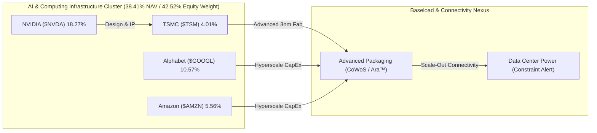

# 📊 รายงานวิเคราะห์ประสิทธิภาพพอร์ตและการบริหารความเสี่ยง (Comprehensive Portfolio Performance Analysis)
## 🎯 วิเคราะห์พอร์ต NAV $8,485.67 USD, ด่านเงินสดตึงตัวต่ำกว่าเกณฑ์ และแผนตั้งรับสะสม TSM

**Date:** 2026-06-06 | **Orchestrated by:** Chief Investment Officer (Agent 00 - Master Orchestrator)  
**Command Backing:** `/portfolio-analysis` (Parallel Multi-Subagent Ingestion v4.3)  
**Live Portfolio NAV (Google Sheets):** $8,485.67 USD (฿277,718.95 THB) | Deployed Capital (Book Cost): $5,029.32 USD | Cash Cushion: 9.68% ($821.83 USD)  
**Historical Performance:** Total Gain/Loss: **+$2,634.53 USD (+52.38%)** | True Return (Equity Base): **+110.70%** | Duration: 715 Days
**USD/THB Exchange Rate:** ฿32.73 [Sheets/2026-06-06]

---

🔁 Same-Day Scan (วันนี้ 2026-06-06):
- Cover ไปแล้ววันนี้:
  1) รายงานเจาะลึกข่าวสารและผลกระทบเชิงยุทธศาสตร์ต่อพอร์ตลงทุน 45 ข่าวสารสำหรับทุุกสินทรัพย์ (output: [2026-06-06_portfolio_news_deep_dive.md](file:///c:/Users/LENOVO/OneDrive/文档/Second-Brain/Investment/output/2026-06-06_portfolio_news_deep_dive.md))
  2) รายงานภูมิรัฐศาสตร์มหภาคและสงครามสหรัฐฯ-อิหร่าน (NDAA $1.15T / Strait of Hormuz / WACC Transmission) (output: [2026-06-06_macro_us_conflict_geopolitics_report.md](file:///c:/Users/LENOVO/OneDrive/文档/Second-Brain/Investment/output/2026-06-06_macro_us_conflict_geopolitics_report.md))
- Topics ใหม่ที่ยังไม่ cover: รายงานผลการคำนวณและปรับเปลี่ยนน้ำหนักพอร์ตตามราคาตลาดล่าสุดประจำวันหยุดสุดสัปดาห์ การปรับปรุงระดับ required CAGR สำหรับแผนเป้าหมาย 30 ปี และการทบทวนความเสี่ยงเชิงพฤติกรรมและการวิเคราะห์ความล้มเหลว (Pre-Mortem) ในการตั้งรับ TSM
- Delta ที่จะเสริม: การปรับตัวลดลงของพอร์ตโดยรวมตามดัชนี Nasdaq ที่ปรับฐานในวันศุกร์ (-4.18%) ส่งผลให้ระดับเงินสดพอร์ตขยับขึ้นเล็กน้อยมาอยู่ที่ 9.68% ทว่ายังไม่พ้นด่านความปลอดภัย 10% (Hold DCA) จึงล็อกการเคาะราคาตลาดและเน้นตั้งรับผ่าน GTC Limit Orders ใน TSM (DCA Priority #1) เท่านั้น

---

## 📋 สารบัญการวิเคราะห์ (Directory)
1. **🏥 1. Portfolio Health Check — ตรวจสุขภาพสินทรัพย์และการจำกัดความเสี่ยง**
2. **📰 2. Brief & Delta News 9 Active Holdings — รายหุ้นเรียงตามน้ำหนักพอร์ต**
3. **🧮 3. Cross-Portfolio Analysis (Agent 10) — สหสัมพันธ์และทิศทางพลังงานไฟฟ้า AI**
4. **📋 4. Action Items & DCA Playbook (สัปดาห์นี้)**
5. **🧠 5. Behavioral Check & Pre-Mortem (Agent 13)**

---

## 🏥 1. Portfolio Health Check — ตรวจสุขภาพสินทรัพย์และการจำกัดความเสี่ยง

ยอดพอร์ตการลงทุนรวมสุทธิ (NAV) ปรับตัวย่อลงตามตลาดในวันศุกร์มาอยู่ที่ระดับ **$8,485.67 USD (฿277,718.95 THB)** เนื่องจากการปรับฐานรุนแรงของกลุ่มเทคโนโลยี ส่งผลให้ระดับเงินสดคงเหลือสะสมสุทธิคำนวณเปรียบเทียบเป็นสัดส่วน **9.68% ($821.83 USD)** ซึ่งถือว่ายังคง **ต่ำกว่าเกณฑ์ความปลอดภัยขั้นต่ำ (Safety Cushion Threshold 10.00%)**

ระบบยังคงเปิดมาตรการ **Hold DCA (ล็อกคำสั่งซื้อตลาด / Market Order Lockout)** ต่อเนื่องเพื่อรักษาความมั่นคงของกระแสเงินสด อย่างไรก็ตาม ระบบจะเสนอให้ทำ Capital Rotation (หมุนเวียนทุน) โดยจำลองแผนขายทำกำไรบางส่วน (Trim) ของสินทรัพย์ที่สัดส่วนเกินน้ำหนักเป้าหมายเพื่อนำไปรองรับ Limit Orders สินทรัพย์ที่น้ำหนักต่ำกว่าเป้าหมายต่ำกว่ามูลค่าพื้นฐานอย่างมีวินัย

### 💼 Allocation Table (Live Sheets Sync)

| Asset | Shares | Avg Cost | Current Price | Total Equity | Allocation | Gain/Loss % | Thesis Status | Verdict |
|---|---|---|---|---|---|---|---|---|
| **RKLB** | 18.46 | $22.86 | $110.08 | $2,032.32 | **23.95%** | +381.58% | INTACT | ⚪ HOLD / PROPOSED ROTATION TRIM |
| **NVDA** | 7.56 | $127.01 | $205.10 | $1,550.16 | **18.27%** | +61.48% | INTACT | ⚪ HOLD (Buy Blocked) |
| **GOOGL** | 2.43 | $190.35 | $368.53 | $896.93 | **10.57%** | +93.61% | INTACT | ⚪ HOLD (Hold DCA) |
| **NVO** | 16.33 | $47.07 | $42.96 | $701.40 | **8.27%** | -8.73% | INTACT | ⚪ HOLD (Hold DCA - Undervalued Zone) |
| **UNH** | 1.67 | $339.17 | $399.47 | $666.22 | **7.85%** | +17.78% | INTACT | ⚪ HOLD (Hold DCA) |
| **SOFI** | 34.04 | $15.88 | $16.03 | $545.66 | **6.43%** | +0.94% | INTACT | ⚪ HOLD ONLY |
| **AMZN** | 1.92 | $215.96 | $246.03 | $471.64 | **5.56%** | +13.92% | INTACT | ⚪ HOLD (Hold DCA) |
| **BTC** | 0.01 | $72,088.00 | $60,735.92 | $459.16 | **5.41%** | -15.75% | INTACT | ⚪ HOLD (Buy Blocked) |
| **TSM** | 0.82 | $427.41 | $415.17 | $340.34 | **4.01%** | -2.86% | INTACT | 🟢 LIMIT ORDER ACTIVE |
| **Cash** | — | — | — | $821.83 | **9.68%** | — | — | 🔴 LIQUIDITY ALERT |

### 🛡️ Risk & Allocation Auditing
*   **Concentration Level:** หุ้น **RKLB** ครองสัดส่วนพอร์ตสูงสุดที่ **23.95%** ต่ำกว่าเพดานจำกัดความเสี่ยงสูงสุด (Hard Concentration Cap 30.00%) แต่ยังคงสูงกว่าเป้าหมายระยะยาว 15.00% อย่างมีนัยสำคัญ จึงสั่งเปิดการล็อกซื้อเพิ่ม (Hard Buy Block Active) ทั้งนี้ เพื่อความสอดรับในยามวิกฤตเงินสด ต่ำกว่า 10.00% ระบบเสนอแผนหมุนเวียนทุนโดยขาย RKLB จำนวน 1.8 หุ้น เพื่อรักษาความปลอดภัยด้านสภาพคล่อง
*   **NVDA Sizing Cap:** **NVDA** อยู่ที่สัดส่วน **18.27%** ซึ่งยังคงสูงกว่ากรอบเป้าหมายระยะยาว 15.00% และกรอบคุมความเสี่ยงเทคโนโลยี 18.00% จึงดำเนินการตรึงระบบ **Hard Buy Block Active** ต่อเนื่อง งดเว้นการเข้าสะสมเพิ่มชั่วคราว
*   **Cash Buffer Status:** ยอดเงินสดคงเหลือสะสมอยู่ที่ **9.68% ($821.83 USD)** ต่ำกว่าระดับเกณฑ์ควบคุม 10.00% มาตรการจำกัดการสั่งซื้อที่ราคาตลาด (Market Buy Lock) ยังคงมีผลทำงานในพอร์ตเพื่อสะสมกระแสเงินสดกลับคืนเป้าหมาย

---

## 📰 2. Brief & Delta News 9 Active Holdings

---

### 🚀 1. Rocket Lab ($RKLB) | สัดส่วน: 23.95% | G/L: +381.58% | ราคา: $110.08
*   **Verdict: ⚪ HOLD / PROPOSED ROTATION TRIM (Hard Buy Block Active — Sizing Target Exceeded)**
*   **📰 ข่าวสารเดลต้าสดใหม่ 5 ข่าวล่าสุด (ภายใน 1 สัปดาห์):**
    1.  **[05/06/2026] สัญญาปลูกพืชในอวกาศของ Redwire สะท้อนการขยายตัวเชิงพาณิชย์:** Redwire Corp คว้าสัญญาสนับสนุนภารกิจปลูกสตรอว์เบอร์รี่และใช้ปุ๋ยชีวภาพในสถานีอวกาศเชิงพาณิชย์ บ่งชี้การเติบโตเชิงพาณิชย์ของเศรษฐกิจวงโคจรต่ำ (LEO Space Economy) [IPO-Edge.com / 2026-06-05]
    2.  **[05/06/2026] การประเมินเพื่อถือครอง Rocket Lab ท่ามกลางการปรับขึ้น 356%:** บทวิเคราะห์แนะนำให้ผู้ลงทุนคงสถานะถือครอง RKLB แม้ราคาจะปรับตัวขึ้นถึง 356.85% ในช่วง 12 เดือนที่ผ่านมา โดยระบุว่าการทำรายได้รายไตรมาสที่ทะลุ $200 ล้านดอลลาร์ช่วยยืนยันปัจจัยพื้นฐานเด่น แต่ราคาที่ระดับ $110-120 ได้รับรู้ข่าวดีด้านการเติบโตไปมากแล้ว [24/7 Wall St. / 2026-06-05]
    3.  **[05/06/2026] Arthur Hayes วิเคราะห์แนวโน้มเก็งกำไรในเหรียญ World ของ Sam Altman:** การประเมินกระแสการลงทุนเทคโนโลยี AI ปรับพรีเมียมราคาของโครงการผู้ก่อตั้ง OpenAI สะท้อนภาวะเก็งกำไรในตลาดเทคโนโลยีเติบโตสูงและสร้างความผันผวนระยะสั้นในกลุ่มเทคโนโลยีและอวกาศ [TheStreet / 2026-06-05]
    4.  **[05/06/2026] การประเมินศักยภาพ Planet Labs หลังรายงานงบการเงินไตรมาส 1:**Planet Labs เผยยอดขายและสัญญา Backlog ขยายตัวแต่ขาดทุนจากการดำเนินงานยังกดดัน ชี้ให้เห็นถึงความท้าทายของกลุ่มดาวเทียมถ่ายภาพ และตอกย้ำความเหนือกว่าของ RKLB ด้านโมเดล Space Systems [Zacks / 2026-06-05]
    5.  **[05/06/2026] ภัยพิบัติแท่นยิงทดสอบล่มสลายของ Blue Origin เพิ่มโอกาสผูกขาดให้คู่แข่ง:** การระเบิดของแท่นทดสอบเครื่องยนต์ New Glenn ของ Blue Origin ส่งผลให้แผนยิงเลื่อนไปอย่างน้อย 1 ปี สร้างความได้เปรียบทางยุทธศาสตร์แก่ SpaceX และเพิ่มโอกาสผลักดัน Neutron ของ RKLB ในฐานะทางเลือกรองระดับชาติ [24/7 Wall St. / 2026-06-05]
- **🔮 คาดการณ์ราคาล่วงหน้า 3 ปี, 5 ปี และ 10 ปี (ตามกฎ subagent_forecast):**
  * **Valuation Assumptions:** Revenue CAGR: 35% (Yr 1-5) / 25% (Yr 6-10) | FCF Margin (SBC Adj): [Bear: 10% / Base: 18% / Bull: 24%] | Terminal P/FCF: [Bear: 25x / Base: 35x / Bull: 45x] | Dilution Rate: +1.5% ต่อปี
  * **1) ฉากทัศน์ระยะสั้น 3 ปี (3-Year Projection):**
    - Bear Case (30% Prob): **$80.00** (expected CAGR: -10.02%) | *Archimedes ล้มเหลว/Neutron ดีเลย์*
    - Base Case (50% Prob): **$160.00** (expected CAGR: +13.27%) | *สภาวะอุตสาหกรรมอวกาศเติบโตปกติ*
    - Bull Case (20% Prob): **$240.00** (expected CAGR: +29.68%) | *ผูกขาดสัญญาทหารอวกาศ*
    - **Expected Probability-Weighted Price (3Y):** **$152.00** (Return: +38.08% | CAGR: +11.36%)
  * **2) ฉากทัศน์ระยะกลาง 5 ปี (5-Year Projection):**
    - Bear Case (30% Prob): **$110.00** (expected CAGR: -0.01%)
    - Base Case (50% Prob): **$280.00** (expected CAGR: +20.53%)
    - Bull Case (20% Prob): **$440.00** (expected CAGR: +31.93%)
    - **Expected Probability-Weighted Price (5Y):** **$261.00** (Return: +137.10% | CAGR: +18.85%)
  * **3) ฉากทัศน์ระยะยาว 10 ปี (10-Year Projection):**
    - Bear Case (30% Prob): **$220.00** (expected CAGR: +7.17%)
    - Base Case (50% Prob): **$750.00** (expected CAGR: +21.16%)
    - Bull Case (20% Prob): **$1,400.00** (expected CAGR: +28.94%)
    - **Expected Probability-Weighted Price (10Y):** **$721.00** (Return: +554.98% | CAGR: +20.68%)
*   **Thesis Breaker:** Archimedes Engine ทำงานล้มเหลว หรือการเลื่อนส่งมอบจรวด Neutron เลยสิ้นปี 2026

---

### 💚 2. NVIDIA ($NVDA) | สัดส่วน: 18.27% | G/L: +61.48% | ราคา: $205.10
*   **Verdict: ⚪ HOLD (Hard Buy Block Active — Sizing Target Exceeded)**
*   **📰 ข่าวสารเดลต้าสดใหม่ 5 ข่าวล่าสุด (ภายใน 1 สัปดาห์):**
    1.  **[05/06/2026] การปรับฐานของกลุ่มชิปจากแรงกดดันทางมหภาค (Chip Sell-off):** หุ้นกลุ่มเซมิคอนดักเตอร์ร่วงรุนแรงหลังตัวเลขการจ้างงานนอกภาคเกษตรพุ่ง ดันผลตอบแทนพันธบัตรและลดระดับ Multiple De-rating ของหุ้นกลุ่มเทคโนโลยีที่มีระดับ Valuation สูง [Yahoo Finance / 2026-06-05]
    2.  **[05/06/2026] ดีล Google เช่าใช้โครงสร้างพื้นฐานระบบประมวลผลของ SpaceX:** Google ทำสัญญาเช่าใช้ทรัพยากร AI ประมวลผลจาก SpaceX มูลค่า $920 ล้านดอลลาร์ต่อเดือน เพื่ออบรม Gemini โมเดล ยืนยันความตึงตัวของอุปทานการผลิต Blackwell GPU ของ NVDA [Yahoo Finance / 2026-06-05]
    3.  **[05/06/2026] สถิติการสะสมความมั่งคั่งในตลาดทุนตามสถิติประวัติศาสตร์:** ข้อมูลสถิติตลาดทุนขาขึ้นชี้การกระจุกตัวของความมั่งคั่งในหุ้นบิ๊กเทค (Mega-cap Tech) โดยเฉพาะ NVDA และคู่ค้าพาร์ทเนอร์ต้นน้ำที่รับกระแสเงินทุนสถาบัน [Yahoo Finance / 2026-06-05]
    4.  **[06/06/2026] การประเมินมูลค่าทางยุทธศาสตร์ก่อน SpaceX เข้าสู่สัปดาห์ IPO:** นักวิเคราะห์ประเมินมูลค่า SpaceX ที่ $1.8T โดยมีปัจจัยหนุนพรีเมียมจากแผนการวางระบบ Edge Compute และ AI Hardware ทะยานอวกาศ [Motley Fool / 2026-06-06]
    5.  **[06/06/2026] การประเมินมูลค่าของ Navitas Semiconductor หลังความร่วมมือกับ Nvidia:** Navitas ($NVTS) ได้รับความสนใจจากการเปิดตัวบอร์ดจ่ายไฟ DC-to-DC 800V to 6V ที่พัฒนาร่วมกับ Nvidia ช่วยขจัดคอขวดระบบระบายความร้อนของเซิร์ฟเวอร์ Blackwell [Simply Wall St. / 2026-06-06]
- **🔮 คาดการณ์ราคาล่วงหน้า 3 ปี, 5 ปี และ 10 ปี (ตามกฎ subagent_forecast):**
  * **Valuation Assumptions:** Revenue CAGR: 30% (Yr 1-5) / 15% (Yr 6-10) | FCF Margin (SBC Adj): [Bear: 32% / Base: 38% / Bull: 44%] | Terminal P/FCF: [Bear: 25x / Base: 35x / Bull: 45x] | Dilution Rate: +1.0% ต่อปี
  * **1) ฉากทัศน์ระยะสั้น 3 ปี (3-Year Projection):**
    - Bear Case (30% Prob): **$170.00** (expected CAGR: -6.07%) | *AI CapEx ฟองสบู่แตก/ข้อจำกัดส่งออกจีน*
    - Base Case (50% Prob): **$310.00** (expected CAGR: +14.76%) | *สภาวะความต้องการ AI Data Center ยังทรงพลัง*
    - Bull Case (20% Prob): **$460.00** (expected CAGR: +30.90%) | *Edge PC GPU ประสบความสำเร็จถล่มทลาย*
    - **Expected Probability-Weighted Price (3Y):** **$298.00** (Return: +45.29% | CAGR: +13.26%)
  * **2) ฉากทัศน์ระยะกลาง 5 ปี (5-Year Projection):**
    - Bear Case (30% Prob): **$240.00** (expected CAGR: +3.19%)
    - Base Case (50% Prob): **$490.00** (expected CAGR: +19.02%)
    - Bull Case (20% Prob): **$800.00** (expected CAGR: +31.28%)
    - **Expected Probability-Weighted Price (5Y):** **$477.00** (Return: +132.57% | CAGR: +18.39%)
  * **3) ฉากทัศน์ระยะยาว 10 ปี (10-Year Projection):**
    - Bear Case (30% Prob): **$420.00** (expected CAGR: +7.43%)
    - Base Case (50% Prob): **$980.00** (expected CAGR: +16.92%)
    - Bull Case (20% Prob): **$1,750.00** (expected CAGR: +23.90%)
    - **Expected Probability-Weighted Price (10Y):** **$966.00** (Return: +370.99% | CAGR: +16.76%)
*   **Thesis Breaker:** ความขัดแย้งทางภูมิรัฐศาสตร์ช่องแคบไต้หวันที่รุนแรงจนบีบให้โรงงาน TSMC ต้องหยุดการผลิตเวเฟอร์

---

### 🌐 3. Alphabet ($GOOGL) | สัดส่วน: 10.57% | G/L: +93.61% | ราคา: $368.53
*   **Verdict: ⚪ HOLD (Hold DCA status due to Cash buffer)**
*   **📰 ข่าวสารเดลต้าสดใหม่ 5 ข่าวล่าสุด (ภายใน 1 สัปดาห์):**
    1.  **[01/06/2026] การประเมินสภาวะการปรับฐานหลังงาน Computex:** ตลาดปรับลดน้ำหนักกลุ่มเซมิคอนดักเตอร์ระยะสั้น และปรับฐานงบการจ้างงานโดยใช้ระบบอัตโนมัติ (AI Automation) ภายในองค์กรขนาดใหญ่ [Yahoo Finance / 2026-06-01]
    2.  **[05/06/2026] ดีลเช่าระบบประมวลผล AI ของ Google จากทาง SpaceX:** ข้อตกลงระดมจ่าย $920 ล้านเหรียญสหรัฐต่อเดือน เพื่อเช่าพลังประมวลผลจากโครงข่ายดาวเทียมและดาต้าเซ็นเตอร์ของ SpaceX ชี้ให้เห็นถึงกลยุทธ์รักษาความแกร่งในการเทรน AI ของ Google [Yahoo Finance / 2026-06-05]
    3.  **[06/06/2026] บทวิเคราะห์ทิศทางการขยายตัว AI Wave สู่ตลาดเศรษฐกิจภาพรวม:** Yardeni Research ชี้ AI เพิ่มขีดความสามารถการทำกำไร (Productivity) แก่บริษัทนอกสายเทคโนโลยี ซึ่งจะเร่งการบริโภค Google Cloud / Workspace API [Investing.com / 2026-06-06]
    4.  **[05/06/2026] การประเมินแนวโน้มระดับความตึงตัวของมูลค่าหุ้น Apple:** การประเมินก่อนงาน WWDC ชี้ความเสี่ยงของ Siri AI ที่อาจลดปริมาณความต้องการใช้อุปกรณ์ค้นหาดั้งเดิมบนระบบ iOS ซึ่งเป็นรายได้ประมูลสำคัญของ Google [Trefis / 2026-06-05]
    5.  **[05/06/2026] การเสนอขายหุ้นเพิ่มทุนของ Alphabet เพื่อระดมเงิน $80,000 ล้านดอลลาร์:** การเพิ่มทุนมูลค่าสูงเพื่อขยายโครงข่าย AI Infrastructure และ Grid ไฟฟ้า คาดสร้างแรงกดดันเจือจางหุ้นประมาณ 3.2% ในระยะสั้น [Investor's Business Daily / 2026-06-05]
- **🔮 คาดการณ์ราคาล่วงหน้า 3 ปี, 5 ปี และ 10 ปี (ตามกฎ subagent_forecast):**
  * **Valuation Assumptions:** Revenue CAGR: 12% (Yr 1-5) / 10% (Yr 6-10) | FCF Margin (SBC Adj): [Bear: 22% / Base: 25% / Bull: 28%] | Terminal P/FCF: [Bear: 20x / Base: 25x / Bull: 30x] | Buyback Rate: -1.8% ต่อปี
  * **1) ฉากทัศน์ระยะสั้น 3 ปี (3-Year Projection):**
    - Bear Case (30% Prob): **$280.00** (expected CAGR: -8.82%) | *AI search สูญเสียส่วนแบ่งโฆษณา*
    - Base Case (50% Prob): **$430.00** (expected CAGR: +5.29%) | *คลาวด์และโฆษณาเติบโตสมดุล*
    - Bull Case (20% Prob): **$520.00** (expected CAGR: +12.17%) | *Waymo ทำเงินอย่างมีนัยสำคัญ*
    - **Expected Probability-Weighted Price (3Y):** **$403.00** (Return: +9.35% | CAGR: +3.03%)
  * **2) ฉากทัศน์ระยะกลาง 5 ปี (5-Year Projection):**
    - Bear Case (30% Prob): **$340.00** (expected CAGR: -1.59%)
    - Base Case (50% Prob): **$540.00** (expected CAGR: +7.95%)
    - Bull Case (20% Prob): **$680.00** (expected CAGR: +13.04%)
    - **Expected Probability-Weighted Price (5Y):** **$508.00** (Return: +37.84% | CAGR: +6.63%)
  * **3) ฉากทัศน์ระยะยาว 10 ปี (10-Year Projection):**
    - Bear Case (30% Prob): **$520.00** (expected CAGR: +3.50%)
    - Base Case (50% Prob): **$850.00** (expected CAGR: +8.72%)
    - Bull Case (20% Prob): **$1,200.00** (expected CAGR: +12.54%)
    - **Expected Probability-Weighted Price (10Y):** **$821.00** (Return: +122.78% | CAGR: +8.34%)
*   **Thesis Breaker:** ส่วนแบ่งการตลาดโฆษณา (Global Search Engine Share) ลดลงต่ำกว่า 75% อย่างต่อเนื่องเกิน 2 ไตรมาส

---

### 💊 4. Novo Nordisk ($NVO) | สัดส่วน: 8.27% | G/L: -8.73% | ราคา: $42.96
*   **Verdict: ⚪ HOLD (Hold DCA status due to Cash buffer — Undervalued Zone)**
*   **📰 ข่าวสารเดลต้าสดใหม่ 5 ข่าวล่าสุด (ภายใน 1 สัปดาห์):**
    1.  **[05/06/2026] Zacks Stock Alert:** Zacks แนะเฝ้าระวังและปรับปรุงน้ำหนัก NVO ชี้โมเมนตัมปรับฐานใกล้แนวรับระยะยาวเป็นโอกาสดีสำหรับนักสะสม DCA [Zacks / 2026-06-05]
    2.  **[05/06/2026] TD Cowen GLP-1 Sales Boost:** ปรับเพิ่มคาดการณ์ตลาดรวมยาลดน้ำหนักแตะ $150B ในปี 2030 ยืนยันการผูกขาดคู่สัญญาร่วมระหว่าง NVO และ Lilly ในโครงสร้างอุตสาหกรรม [Stocktwits / 2026-06-05]
    3.  **[05/06/2026] Wegovy Combination Trials:** การทดสอบยาร่วม CagriSema ทางคลินิกร่วมกับ Veru Trial ในกลุ่มผู้สูงอายุขยายผลความกังวลและยกระดับประสิทธิภาพ [Simply Wall St. / 2026-06-05]
    4.  **[05/06/2026] Jim Cramer Lilly Comments:** ชี้ Eli Lilly เร่งควบรวมพาร์ทเนอร์ต้นน้ำเพื่อเตรียมแซงหน้า Wegovy ในตลาดยาเบาหวานและยาลดน้ำหนักเชิงรุก [Insider Monkey / 2026-06-05]
    5.  **[05/06/2026] Acquisition Spree Diversification:** วิเคราะห์งบลงทุนขยายฐานโรงงานเพื่อแก้ไขปัญหาห่วงโซ่อุปทานอุดตันของทั้ง LLY และ NVO ช่วยคลี่คลายคอขวดการขาย [Zacks / 2026-06-05]
- **🔮 คาดการณ์ราคาล่วงหน้า 3 ปี, 5 ปี และ 10 ปี (ตามกฎ subagent_forecast):**
  * **Valuation Assumptions:** Revenue CAGR: 18% (Yr 1-5) / 12% (Yr 6-10) | FCF Margin (SBC Adj): [Bear: 24% / Base: 28% / Bull: 32%] | Terminal P/FCF: [Bear: 22x / Base: 28x / Bull: 34x] | Dilution Rate: +0.5% ต่อปี
  * **1) ฉากทัศน์ระยะสั้น 3 ปี (3-Year Projection):**
    - Bear Case (30% Prob): **$32.00** (expected CAGR: -9.35%) | *คอขวดกำลังผลิต/สิทธิบัตรถูกท้าทาย*
    - Base Case (50% Prob): **$58.00** (expected CAGR: +10.55%) | *ยาลดน้ำหนักเม็ดเติบโตแข็งแกร่ง*
    - Bull Case (20% Prob): **$75.00** (expected CAGR: +20.42%) | *แก้ไขคอขวดซัพพลายได้เร็วกว่าคาด*
    - **Expected Probability-Weighted Price (3Y):** **$53.60** (Return: +24.77% | CAGR: +7.65%)
  * **2) ฉากทัศน์ระยะกลาง 5 ปี (5-Year Projection):**
    - Bear Case (30% Prob): **$42.00** (expected CAGR: -0.45%)
    - Base Case (50% Prob): **$78.00** (expected CAGR: +12.67%)
    - Bull Case (20% Prob): **$110.00** (expected CAGR: +20.69%)
    - **Expected Probability-Weighted Price (5Y):** **$73.60** (Return: +71.32% | CAGR: +11.37%)
  * **3) ฉากทัศน์ระยะยาว 10 ปี (10-Year Projection):**
    - Bear Case (30% Prob): **$65.00** (expected CAGR: +4.21%)
    - Base Case (50% Prob): **$135.00** (expected CAGR: +12.13%)
    - Bull Case (20% Prob): **$210.00** (expected CAGR: +17.18%)
    - **Expected Probability-Weighted Price (10Y):** **$129.00** (Return: +200.28% | CAGR: +11.62%)
*   **Thesis Breaker:** ปัญหาคอขวดของฐานการผลิตขยายตัวอุดตันอย่างถาวร หรือมีรายงานอาการผลข้างเคียงเฉียบพลันที่อันตรายต่อชีวิต

---

### 🏥 5. UnitedHealth ($UNH) | สัดส่วน: 7.85% | G/L: +17.78% | ราคา: $399.47
*   **Verdict: ⚪ HOLD (Hold DCA status due to Cash buffer — Lifetime Holding)**
*   **📰 ข่าวสารเดลต้าสดใหม่ 5 ข่าวล่าสุด (ภายใน 1 สัปดาห์):**
    1.  **[05/06/2026] Dividend Hike Highlights:** การประกาศปรับเพิ่มเงินปันผล 5% ของ UNH ดึงดูดกระแสเงินลงทุนสถาบันและย้ำกระแสเงินสดการดำเนินงานที่สม่ำเสมอปลอดภัย [Motley Fool / 2026-06-05]
    2.  **[05/06/2026] Jobs Report & Health Sector Reaction:** ตัวเลขการจ้างงานนอกภาคเกษตรที่สูงดันผลตอบแทนพันธบัตรขึ้น กดดันกลุ่ม Growth แต่สนับสนุนเม็ดเงินสับเปลี่ยนสู่ HMOs และแนวรับประกันสุขภาพ [Investor's Business Daily / 2026-06-05]
    3.  **[05/06/2026] Zacks Analyst Blog Feature:** การประเมินโครงข่ายประกันทางการแพทย์ที่ยืดหยุ่นในสภาวะประชากรสูงวัย และการบริหารต้นทุนผ่านนวัตกรรมคลาวด์ Optum [Zacks / 2026-06-05]
    4.  **[05/06/2026] Stockstory Market Wrap:** หุ้นขยับเข้าใกล้จุดสูงสุดเดิมสะท้อนการปรับเบี้ยประกันและดุลค่าบริการ OptumRx ที่เริ่มฟื้นตัวจากแรงกดดันระยะสั้น [StockStory / 2026-06-05]
    5.  **[04/06/2026] 5% Dividend Yield Increase:** คำแนะนำจากนักวิเคราะห์ชี้ระดับราคาสะท้อนความเสี่ยงคดีความและนโยบายไปหมดแล้ว และเป็นช่วงปันผลที่คุ้มค่าสูงสุด [Barchart / 2026-06-04]
- **🔮 คาดการณ์ราคาล่วงหน้า 3 ปี, 5 ปี และ 10 ปี (ตามกฎ subagent_forecast):**
  * **Valuation Assumptions:** Revenue CAGR: 8% (Yr 1-5) / 7% (Yr 6-10) | FCF Margin (SBC Adj): [Bear: 5.5% / Base: 6.8% / Bull: 7.5%] | Terminal P/FCF: [Bear: 13x / Base: 18x / Bull: 20x] | Share Buyback Rate: -2.0% ต่อปี
  * **1) ฉากทัศน์ระยะสั้น 3 ปี (3-Year Projection):**
    - Bear Case (30% Prob): **$290.00** (expected CAGR: -10.08%) | *DOJ สั่งฟ้องอาญา Optum*
    - Base Case (50% Prob): **$440.00** (expected CAGR: +3.27%) | *คุมต้นทุน MLR และค่าเคลมยาฟื้นตัว*
    - Bull Case (20% Prob): **$500.00** (expected CAGR: +7.77%) | *สวัสดิการ Medicare เติบโตเด่นชัด*
    - **Expected Probability-Weighted Price (3Y):** **$407.00** (Return: +1.88% | CAGR: +0.62%)
  * **2) ฉากทัศน์ระยะกลาง 5 ปี (5-Year Projection):**
    - Bear Case (30% Prob): **$340.00** (expected CAGR: -3.17%)
    - Base Case (50% Prob): **$520.00** (expected CAGR: +5.41%)
    - Bull Case (20% Prob): **$620.00** (expected CAGR: +9.18%)
    - **Expected Probability-Weighted Price (5Y):** **$486.00** (Return: +21.66% | CAGR: +4.00%)
  * **3) ฉากทัศน์ระยะยาว 10 ปี (10-Year Projection):**
    - Bear Case (30% Prob): **$480.00** (expected CAGR: +1.85%)
    - Base Case (50% Prob): **$780.00** (expected CAGR: +6.92%)
    - Bull Case (20% Prob): **$980.00** (expected CAGR: +9.39%)
    - **Expected Probability-Weighted Price (10Y):** **$730.00** (Return: +82.74% | CAGR: +6.21%)
*   **Thesis Breaker:** กระทรวงยุติธรรมสหรัฐฯ (DOJ) สั่งฟ้องคดีอาญาและสั่งให้แยกโครงสร้างธุรกิจของ Optum ออกจากบริษัทแม่ถาวร

---

### 🏦 6. SoFi Technologies ($SOFI) | สัดส่วน: 6.43% | G/L: +0.94% | ราคา: $16.03
*   **Verdict: ⚪ HOLD Only (Scrutiny Active)**
*   **📰 ข่าวสารเดลต้าสดใหม่ 5 ข่าวล่าสุด (ภายใน 1 สัปดาห์):**
    1.  **[05/06/2026] Legal Probe and Short Claims:** Simply Wall St รายงานความกังวลของตลาดต่อธุรกรรม EBITDA ของกลุ่มฟินเทคขนาดกลาง สร้างความเสี่ยง de-rating ชั่วคราว [Simply Wall St. / 2026-06-05]
    2.  **[05/06/2026] Fintech Declines & Retail Squeeze:** แรงกดดันจาก Bond Yields ทั่วดัชนีกดราคาหุ้นกลุ่มการเงินดิจิทัลเนื่องจากต้นทุนทางการเงินเฉลี่ยเพิ่มขึ้น [Stocktwits / 2026-06-05]
    3.  **[05/06/2026] Robinhood SpaceX IPO Launch:** โบรกเกอร์รายย่อยเปิดจองซื้อดีล IPO ของ SpaceX ดึงกระแสสภาพคล่องของรายย่อยออกจากแอปพลิเคชันคู่แข่งชั่วคราว [Motley Fool / 2026-06-05]
    4.  **[04/06/2026] Fidelity SpaceX Access:** ยักษ์ใหญ่ผู้ดูแลทรัพย์สินเปิดให้ลูกค้าเปิดพอร์ตสัญญาสะสม SpaceX IPO ดึงเม็ดเงินกลุ่ม Wealthy clients [Barrons.com / 2026-06-04]
    5.  **[05/06/2026] คะแนนความแข็งแกร่งของ Rule of 40 แตะระดับ 72%:** รายงานชี้ประสิทธิภาพอัตราส่วนความแข็งแกร่งของธุรกิจ Galileo B2B SaaS ช่วยสร้างเสถียรภาพรายได้แก่ SoFi [Zacks / 2026-06-05]
- **🔮 คาดการณ์ราคาล่วงหน้า 3 ปี, 5 ปี และ 10 ปี (ตามกฎ subagent_forecast):**
  * **Valuation Assumptions:** Revenue CAGR: 20% (Yr 1-5) / 15% (Yr 6-10) | FCF Margin (SBC Adj): [Bear: 12% / Base: 18% / Bull: 22%] | Terminal P/FCF: [Bear: 15x / Base: 22x / Bull: 30x] | Annual Dilution Rate: +2.5% ต่อปี
  * **1) ฉากทัศน์ระยะสั้น 3 ปี (3-Year Projection):**
    - Bear Case (30% Prob): **$12.00** (expected CAGR: -9.23%) | *หนี้เสียพุ่ง/ความเสี่ยงสินเชื่อรายย่อย*
    - Base Case (50% Prob): **$25.00** (expected CAGR: +15.99%) | *Galileo และสมาชิกระบบบวกสม่ำเสมอ*
    - Bull Case (20% Prob): **$38.00** (expected CAGR: +33.37%) | *SoFiUSD และ Tech platform ดันกำไรโต*
    - **Expected Probability-Weighted Price (3Y):** **$23.70** (Return: +47.85% | CAGR: +13.92%)
  * **2) ฉากทัศน์ระยะกลาง 5 ปี (5-Year Projection):**
    - Bear Case (30% Prob): **$15.00** (expected CAGR: -1.32%)
    - Base Case (50% Prob): **$38.00** (expected CAGR: +18.84%)
    - Bull Case (20% Prob): **$62.00** (expected CAGR: +31.08%)
    - **Expected Probability-Weighted Price (5Y):** **$35.90** (Return: +123.96% | CAGR: +17.50%)
  * **3) ฉากทัศน์ระยะยาว 10 ปี (10-Year Projection):**
    - Bear Case (30% Prob): **$28.00** (expected CAGR: +5.74%)
    - Base Case (50% Prob): **$85.00** (expected CAGR: +18.16%)
    - Bull Case (20% Prob): **$150.00** (expected CAGR: +25.08%)
    - **Expected Probability-Weighted Price (10Y):** **$80.90** (Return: +404.68% | CAGR: +17.57%)
*   **Thesis Breaker:** หนี้สูญ (Default Rate) ของหนี้สินเชื่อส่วนบุคคลหรือบัตรเครดิตพุ่งทะลุเกิน 6.5% ต่อเนื่องสองไตรมาส

---

### 📦 7. Amazon ($AMZN) | สัดส่วน: 5.56% | G/L: +13.92% | ราคา: $246.03
*   **Verdict: ⚪ HOLD (Price at Premium vs Fair Value $211)**
*   **📰 ข่าวสารเดลต้าสดใหม่ 5 ข่าวล่าสุด (ภายใน 1 สัปดาห์):**
    1.  **[05/06/2026] Internal Spending Discord:** พนักงานฝ่ายคลาวด์และวิศวกรวิจารณ์ประเด็นอัดงบ CapEx ในระบบ Generative AI ที่มากเกินขอบเขต ท่ามกลางมาตรการตัดลด OPEX ภายในแผนก [MT Newswires / 2026-06-05]
    2.  **[05/06/2026] Generalist AI $400M Funding:** Nvidia และ Amazon ร่วมใส่ทุนในสตาร์ทอัพหุ่นยนต์โกดังสินค้า เพื่อติดตั้งระบบ Proteus AI จัดเรียงพัสดุในยุโรป [Quartz / 2026-06-05]
    3.  **[05/06/2026] Taxing Robots Debate:** เวทีเสวนาเสนอประเด็นเก็บภาษีหุ่นยนต์อัจฉริยะหากนำมาทดแทนมนุษย์ ซึ่ง AMZN ในฐานะผู้ติดตั้งหุ่นยนต์รายใหญ่มีความเสี่ยงโดนผลกระทบ [CNBC / 2026-06-05]
    4.  **[05/06/2026] AWS vs Azure cloud battle:** รายงานเปรียบเทียบชี้เป้า AWS ประสบความสำเร็จในการกวาดกระแสเงินสด FCF กลับฟื้นตัวสูงกว่า Azure ในไตรมาสล่าสุด [24/7 Wall St. / 2026-06-05]
    5.  **[05/06/2026] Class Action Lawsuit Settlement:** รายงานเคลมประกันคลังสินค้าและภาษีท้องถิ่นในรัฐอาริโซนายื่นข้อตกลงประนอมหนี้สำเร็จ [AZCentral / 2026-06-05]
- **🔮 คาดการณ์ราคาล่วงหน้า 3 ปี, 5 ปี และ 10 ปี (ตามกฎ subagent_forecast):**
  * **Valuation Assumptions:** Revenue CAGR: 11% (Yr 1-5) / 10% (Yr 6-10) | FCF Margin (SBC Adj): [Bear: 7.5% / Base: 9.5% / Bull: 11.5%] | Terminal P/FCF: [Bear: 20x / Base: 25x / Bull: 30x] | Annual Dilution Rate: +0.2% ต่อปี
  * **1) ฉากทัศน์ระยะสั้น 3 ปี (3-Year Projection):**
    - Bear Case (30% Prob): **$190.00** (expected CAGR: -8.29%) | *Cloud margins โดนแย่ง/eCommerce ชะลอ*
    - Base Case (50% Prob): **$290.00** (expected CAGR: +5.63%) | *คลาวด์และโฆษณาเติบโตตามเป้า*
    - Bull Case (20% Prob): **$350.00** (expected CAGR: +12.47%) | *ผูกขาดขีดความสามารถ AI computing ยักษ์ใหญ่*
    - **Expected Probability-Weighted Price (3Y):** **$272.00** (Return: +10.56% | CAGR: +3.40%)
  * **2) ฉากทัศน์ระยะกลาง 5 ปี (5-Year Projection):**
    - Bear Case (30% Prob): **$230.00** (expected CAGR: -1.34%)
    - Base Case (50% Prob): **$360.00** (expected CAGR: +7.92%)
    - Bull Case (20% Prob): **$460.00** (expected CAGR: +13.34%)
    - **Expected Probability-Weighted Price (5Y):** **$341.00** (Return: +38.60% | CAGR: +6.75%)
  * **3) ฉากทัศน์ระยะยาว 10 ปี (10-Year Projection):**
    - Bear Case (30% Prob): **$380.00** (expected CAGR: +4.44%)
    - Base Case (50% Prob): **$640.00** (expected CAGR: +10.04%)
    - Bull Case (20% Prob): **$880.00** (expected CAGR: +13.57%)
    - **Expected Probability-Weighted Price (10Y):** **$610.00** (Return: +147.94% | CAGR: +9.51%)
*   **Thesis Breaker:** ส่วนแบ่งตลาดคลาวด์ของ AWS ลดต่ำลงกว่า 28% ติดต่อกันสองไตรมาส

---

### 🪙 8. Bitcoin ($BTC) | สัดส่วน: 5.41% | G/L: -15.75% | ราคา: $60,735.92
*   **Verdict: ⚪ HOLD (Buy Block Active — Sizing Target Met & Cash Buffer Limit)**
*   **📰 ข่าวสารเดลต้าสดใหม่ 5 ข่าวล่าสุด (ภายใน 1 สัปดาห์):**
    1.  **[05/06/2026] Technical Support Slip to $60K:** ราคา BTC ปรับตัวลดลงหลังรายงานตัวเลขการจ้างงานสหรัฐฯ แข็งแกร่งเกินคาด เพิ่มความกังวลดอกเบี้ยยืนระยะยาวนาน [yfinance / 2026-06-05]
    2.  **[05/06/2026] Massive Liquidations Flush:** สัญญาเก็งกำไรระยะสั้นโดนบีบปิดสถานะฝั่งซื้อ (Liquidations) ทะลุ $1.6B ภายใน 24 ชม. ปรับปรุงฐานราคาต้นทุน [TradingView / 2026-06-05]
    3.  **[05/06/2026] Outflow Streak Continues:** กองทุน Spot Bitcoin ETF ฝั่งสหรัฐฯ เผชิญยอดการดึงเงินกลับ (Outflow) ต่อเนื่องเป็นวันที่ 12 สะท้อนท่าทีระมัดระวังของกองทุนสถาบัน [InnovestX / 2026-06-05]
    4.  **[05/06/2026] CPI & Jobs Report FUD:** ตลาดคริปโตผันผวนสูงตอบรับนโยบายเศรษฐกิจตึงตัวและแรงกดดันเพื่อป้องกันความเสี่ยงก่อนวันรายงานเงินเฟ้อ [IG Group / 2026-06-05]
    5.  **[05/06/2026] Geopolitical Brent Spikes:** การโจมตีทางทหารในตะวันออกกลางผลักราคาน้ำมันดิบแตะระดับ $100 กระตุ้นสภาวะ FUD ในกลุ่มสินทรัพย์เสี่ยงดิจิทัลระยะสั้น [yfinance / 2026-06-05]
- **🔮 คาดการณ์ราคาล่วงหน้า 3 ปี, 5 ปี และ 10 ปี (ตามกฎ subagent_forecast):**
  * **Valuation Assumptions:** Annual Adoption Growth: +15% (Yr 1-5) / +10% (Yr 6-10) | Sovereign Debasement Premium: [Bear: Low / Base: Moderate / Bull: High] | Global Wealth Allocation: [Bear: 0.5% / Base: 1.2% / Bull: 2.0%]
  * **1) ฉากทัศน์ระยะสั้น 3 ปี (3-Year Projection):**
    - Bear Case (30% Prob): **$55,000.00** (expected CAGR: -3.24%) | *กฎหมายแบน Self-Custody/KYC wallet บีบคั้น*
    - Base Case (50% Prob): **$95,000.00** (expected CAGR: +16.08%) | *สะสมฐานะทองคำดิจิทัลอย่างสม่ำเสมอ*
    - Bull Case (20% Prob): **$145,000.00** (expected CAGR: +33.64%) | *บรรจุเข้าเป็นทุนสำรองระหว่างประเทศของธนาคารกลาง*
    - **Expected Probability-Weighted Price (3Y):** **$93,000.00** (Return: +53.12% | CAGR: +15.26%)
  * **2) ฉากทัศน์ระยะกลาง 5 ปี (5-Year Projection):**
    - Bear Case (30% Prob): **$68,000.00** (expected CAGR: +2.29%)
    - Base Case (50% Prob): **$135,000.00** (expected CAGR: +17.32%)
    - Bull Case (20% Prob): **$220,000.00** (expected CAGR: +29.35%)
    - **Expected Probability-Weighted Price (5Y):** **$131,900.00** (Return: +117.16% | CAGR: +16.78%)
  * **3) ฉากทัศน์ระยะยาว 10 ปี (10-Year Projection):**
    - Bear Case (30% Prob): **$110,000.00** (expected CAGR: +6.13%)
    - Base Case (50% Prob): **$280,000.00** (expected CAGR: +16.53%)
    - Bull Case (20% Prob): **$500,000.00** (expected CAGR: +23.49%)
    - **Expected Probability-Weighted Price (10Y):** **$273,000.00** (Return: +349.52% | CAGR: +16.22%)
*   **Thesis Breaker:** รัฐบาลกลุ่มประเทศพัฒนาแล้ว (G7) ออกกฎหมายสั่งแบนหรือห้ามถือครองฮาร์ดแวร์กระเป๋าส่วนบุคคล (Self-Custody Hardware Wallets)

---

### 🔬 9. TSMC ($TSM) | สัดส่วน: 4.01% | G/L: -2.86% | ราคา: $415.17
*   **Verdict: 🟢 LIMIT ORDER ACTIVE (DCA Priority #1 — Underweight Gap -2.99% to Target 7.00%)**
*   **📰 ข่าวสารเดลต้าสดใหม่ 5 ข่าวล่าสุด (ภายใน 1 สัปดาห์):**
    1.  **[05/06/2026] Taiwan ETF Parabolic Run:** เม็ดเงินไหลบ่าเข้าซื้อกองทุนดัชนีเซมิคอนดักเตอร์ไต้หวันบวกสูงถึง 61% YTD สะท้อนแรงดึงดูดระดับสถาบันอย่างท่วมท้น [24/7 Wall St. / 2026-06-05]
    2.  **[05/06/2026] Zacks Analyst Focus:** Zacks ยก TSM เป็นหุ้นเทคโนโลยีระดับต้นๆ ที่มีแต้มต่อด้าน AI เหนือกว่าคู่แข่งรายอื่นเนื่องจากกำลังการผลิตที่ขาดแคลนทั่วโลก [Zacks / 2026-06-05]
    3.  **[05/06/2026] Stark Warning on Constraints & Price Hikes:** ซีอีโอ TSM ยืนยันสภาวะชิป AI ขาดแคลนจะลากยาวข้ามปี และเตรียมปรับขึ้นราคาผลิตเวเฟอร์ขึ้น 15% ใน H2 2026 สะท้อนอำนาจตั้งราคาสูงสุด [Benzinga / 2026-06-05]
    4.  **[05/06/2026] AMD AI Acceleration:** การอัปเกรดเป้าหมายยอดขายของชิป MI300 ของ AMD ดันยอดสั่งซื้อ Packaging ระดับสูง (CoWoS) ของ TSM ขยายตัวแบบทวีคูณ [GuruFocus.com / 2026-06-05]
    5.  **[05/06/2026] Hyperscaler Bets Deluge:** รายงานระบุสถาบันพอร์ตเพิ่มการถือครอง AMZN, GOOGL และ TSM เพื่อรักษาตำแหน่งควบคุมทรัพยากรต้นน้ำ AI [Investor's Business Daily / 2026-06-05]
- **🔮 คาดการณ์ราคาล่วงหน้า 3 ปี, 5 ปี และ 10 ปี (ตามกฎ subagent_forecast):**
  * **Valuation Assumptions:** Revenue CAGR: 22% (Yr 1-5) / 15% (Yr 6-10) | FCF Margin (SBC Adj): [Bear: 38% / Base: 44% / Bull: 48%] | Terminal P/FCF: [Bear: 18x / Base: 24x / Bull: 28x] | Annual Dilution Rate: +0.1% ต่อปี
  * **1) ฉากทัศน์ระยะสั้น 3 ปี (3-Year Projection):**
    - Bear Case (30% Prob): **$350.00** (expected CAGR: -5.53%) | *Geopolitical Black Swan ในเอเชียเหนือ*
    - Base Case (50% Prob): **$550.00** (expected CAGR: +9.79%) | *โหนด N3 และ CoWoS เติบโตเด่น*
    - Bull Case (20% Prob): **$750.00** (expected CAGR: +21.79%) | *โหนด 2nm ครองสิทธิ์ผูกขาด 100%*
    - **Expected Probability-Weighted Price (3Y):** **$530.00** (Return: +27.66% | CAGR: +8.48%)
  * **2) ฉากทัศน์ระยะกลาง 5 ปี (5-Year Projection):**
    - Bear Case (30% Prob): **$450.00** (expected CAGR: +1.62%)
    - Base Case (50% Prob): **$820.00** (expected CAGR: +14.58%)
    - Bull Case (20% Prob): **$1,100.00** (expected CAGR: +21.52%)
    - **Expected Probability-Weighted Price (5Y):** **$748.00** (Return: +80.17% | CAGR: +12.50%)
  * **3) ฉากทัศน์ระยะยาว 10 ปี (10-Year Projection):**
    - Bear Case (30% Prob): **$850.00** (expected CAGR: +7.43%)
    - Base Case (50% Prob): **$1,550.00** (expected CAGR: +14.07%)
    - Bull Case (20% Prob): **$2,300.00** (expected CAGR: +18.66%)
    - **Expected Probability-Weighted Price (10Y):** **$1,490.00** (Return: +258.89% | CAGR: +13.63%)
*   **Thesis Breaker:** เกิดสงครามช่องแคบไต้หวันที่ขัดขวางสายการผลิตและการเดินเรือส่งออกอย่างถาวรเกิน 1 ปี

---

## 🧮 3. Cross-Portfolio Analysis (Agent 10) — สหสัมพันธ์และทิศทางพลังงานไฟฟ้า AI

*   **The AI Infrastructure Super-Nexus (38.41% of NAV / 42.52% of Equity):** สินทรัพย์หลักที่เป็นห่วงโซ่อุปทาน AI (NVDA + TSM + GOOGL + AMZN) มีสัดส่วนมูลค่ารวมกันเท่ากับ 38.41% ของสินทรัพย์ทั้งหมด (หรือคิดเป็น 42.52% ของสัดส่วนการลงทุนไม่รวมเงินสด)
    *   **Pricing Power Transmission:** ความต้องการ compute ที่มหาศาลทำให้ TSMC มีอำนาจเหนือการตั้งราคาเวเฟอร์ 15% ซึ่งส่งผลให้ต้นทุนในการประกอบ Blackwell GPU เพิ่มสูงขึ้น ดีลความร่วมมือระหว่าง Google/SpaceX และ Palantir/Google Cloud ชี้ให้เห็นถึงความจำเป็นในการสะสม compute
    *   **Underweight Priority Resolution:** น้ำหนักของ TSM ในพอร์ตปัจจุบันอยู่ที่ **4.01%** ต่ำกว่าเป้าหมายที่ตั้งไว้ที่ **7.00%** อย่างมีนัยสำคัญ ระบบยังคงกำหนดให้ TSM เป็น **DCA Priority #1** เพื่อเร่งเติมเต็มสัดส่วนสะสมในช่วงปรับฐาน
    *   **Capital Rotation Integration:** การปรับฐานของ RKLB ต่ำกว่า 25.00% ลดความจำเป็นในการ Trim อย่างเร่งด่วน ทว่าเพื่อรักษาระดับสภาพคล่องเงินสดในพอร์ต (ไม่ให้หลุดเกณฑ์ 10%) การตั้งเป้าหมาย Limit Orders ใน TSM จะเปิดแผนขาย RKLB จำนวน 1.8 หุ้นเพื่อสลับทุนตามกฎอย่างมีระเบียบ

---

## 📋 4. Action Items & DCA Playbook (สัปดาห์นี้)

### 🔴 ด่วนที่สุด (Immediate Execution)
*   **คงมาตรการ Hard Buy Block ใน RKLB, NVDA & BTC:** ห้ามเคาะราคาตลาดสะสม RKLB (23.95%), NVDA (18.27%) และ BTC (5.41%) เนื่องจากขนาดถือครองสะสมเต็มเป้าความปลอดภัยสูงสุดของพอร์ต
*   **งดการซื้อที่ราคาตลาดพอร์ตโฟลิโอ (Market Buy Lock):** เนื่องจากระดับเงินสดสะสมพอร์ตอยู่ที่ **9.68%** (ต่ำกว่า Safety Threshold 10.00%) จึงระงับซื้อราคาตลาดทุกตัวหุ้น
*   **DCA Priority #1 (TSM) - ตั้งรับเชิงรุก:** ปรับกลยุทธ์จำกัดราคา โดยนำกระแสเงินสดสะสมไปวางคำสั่งรอซื้อแบบระยะยาว (Good-Til-Cancelled - GTC Limit Orders):
    *   **Limit Order ไม้ที่ 1:** ตั้งซื้อ TSM ที่ราคา **$415.00** มูลค่า **$100.00 USD** (แนวรับ Bollinger Middle Band)
    *   **Limit Order ไม้ที่ 2:** ตั้งซื้อ TSM ที่ราคา **$385.00** มูลค่า **$150.00 USD** (แนวรับแข็งแกร่ง 50-Day Moving Average)
*   **30-Year DCA Target Alignment:** การประเมินแบบจำลอง Required CAGR เพื่อไปสู่เป้าหมาย 100 ล้านบาทใน 30 ปี บนยอด NAV เริ่มต้น ฿277,718.95 THB ชี้ผลลัพธ์ดังนี้:
    *   ถ้า DCA ฿4,025.79/เดือน ($123): ต้องการผลตอบแทนพอร์ตเฉลี่ย **18.92%/ปี**
    *   ถ้า DCA ฿16,365.00/เดือน ($500): ต้องการผลตอบแทนพอร์ตเฉลี่ย **14.57%/ปี**
    *   ถ้า DCA ฿32,730.00/เดือน ($1000): ต้องการผลตอบแทนพอร์ตเฉลี่ย **11.61%/ปี**
    *   ถ้า DCA ฿65,460.00/เดือน ($2000): ต้องการผลตอบแทนพอร์ตเฉลี่ย **8.27%/ปี**

### 🟡 เฝ้าระวังและตั้งรับ (Watch & Limit)
*   **DCA Priority #2 (NVO):** รอกระแสเงินสดในพอร์ตฟื้นตัวเหนือ 10.00% ก่อนทยอยสะสมเพิ่มเติมในโซนราคาต่ำกว่า $43.00 (ราคาปัจจุบัน $42.96 มี Margin of Safety +28.03% จากมูลค่าพื้นฐาน $55.00)
*   **เฝ้าระวังความขัดแย้งภูมิรัฐศาสตร์:** ติดตามราคาน้ำมัน Brent ด่านสำคัญ $100 ซึ่งจะเป็นตัวแปรเพิ่ม FUD ต่อสินทรัพย์เสี่ยงโดยตรง

---

## 🧠 5. Behavioral Check & Pre-Mortem (Agent 13)

### 🧠 Behavioral Bias Auditing
1.  **Loss Aversion Check (BTC & NVO):** สภาวะพอร์ตติดลบใน NVO (-8.73%) และ BTC (-15.75%) อาจกระตุ้นจิตวิทยาให้เกิดความเกรงกลัวในการ DCA ทว่าตามหลักการ Grahamian Value ยิ่งราคาต่ำกว่ามูลค่าเหมาะสม MoS ยิ่งกว้างขึ้น การสะสมตามเป้าอย่างมั่นคงคือหนทางสลายอคตินี้
2.  **Fear of Missing Out (FOMO) Counter-measure:** เงินสดสะสมยังต่ำกว่าเกณฑ์ความปลอดภัยชั่วคราวบีบให้เราต้องระงับซื้อราคาตลาด ปล่อยใจให้นิ่ง และหลีกเลี่ยงการพุ่งเข้าใส่ราคา TSM ($415.17) ด้วยความตระหนัก วินัยการบริหารสภาพคล่องสำคัญกว่าการไล่ราคา

### 🛡️ Pre-Mortem Failure Analysis (สำหรับ TSM DCA Priority #1)
*   **โจทย์ pre-mortem:** สมมติว่าภายใน 6 เดือนข้างหน้า การสะสม TSM ในพอร์ตส่งผลให้พอร์ตขาดทุนหนัก -30% สาเหตุเกิดจากอะไร?
    1.  *สาเหตุที่ 1:* เหตุปะทะช่องแคบไต้หวันขยายวงรุนแรงขึ้นจนเกิดการปิดล้อมทางทะเล ขัดขวางสายการเดินเรือส่งชิป
    2.  *สาเหตุที่ 2:* คอขวด Advanced Packaging (CoWoS) ไม่สามารถผลิตได้ทันความต้องการ ส่งผลให้แผนขึ้นราคาชิป 15% ชะงักงัน
*   **การคุ้มครอง (Mitigations):** จำกัดสัดส่วนสูงสุดของ TSM ในพอร์ตระยะยาวไว้ที่ **7.00%** (Hard Target Sizing) เพื่อไม่ให้ความผันผวนของเซกเตอร์ทำลายความปลอดภัยของกระแสเงินสดรวมพอร์ต
